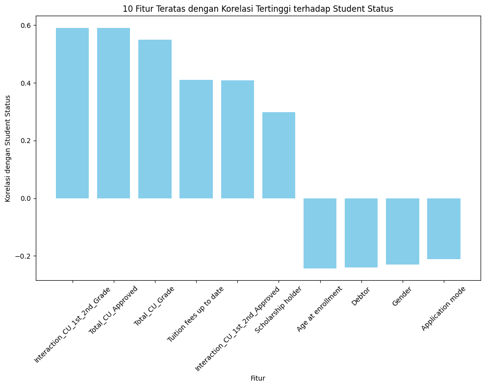
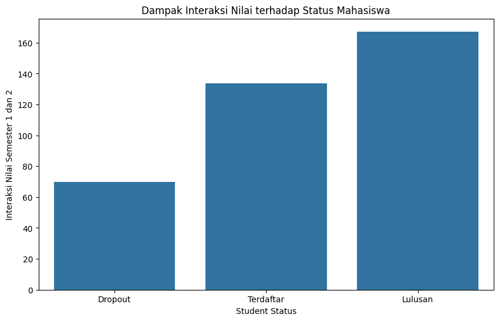
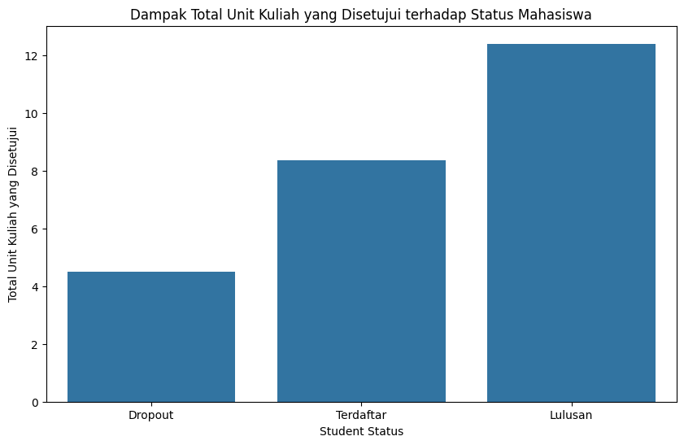
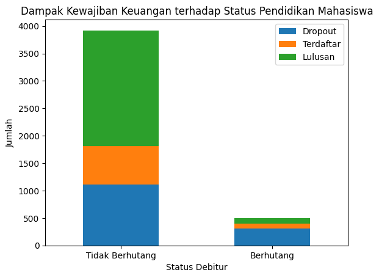
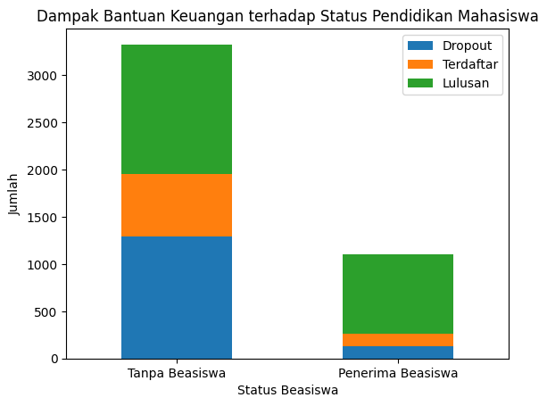
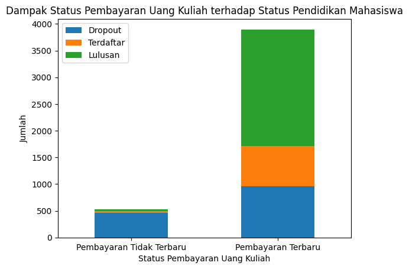
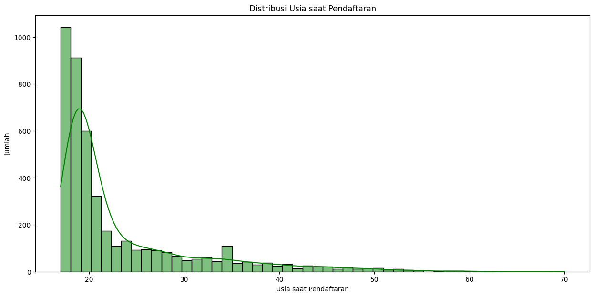
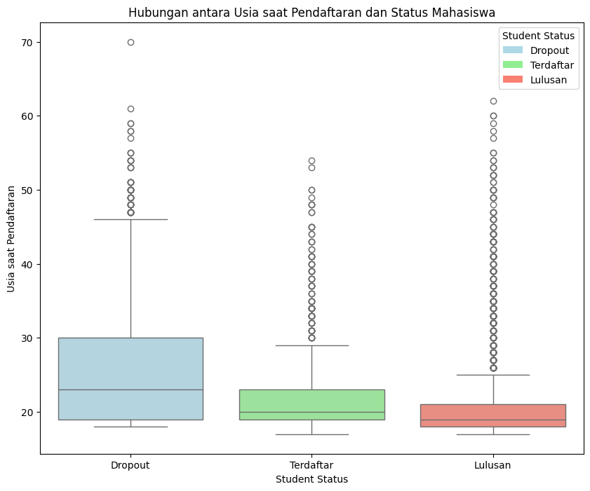
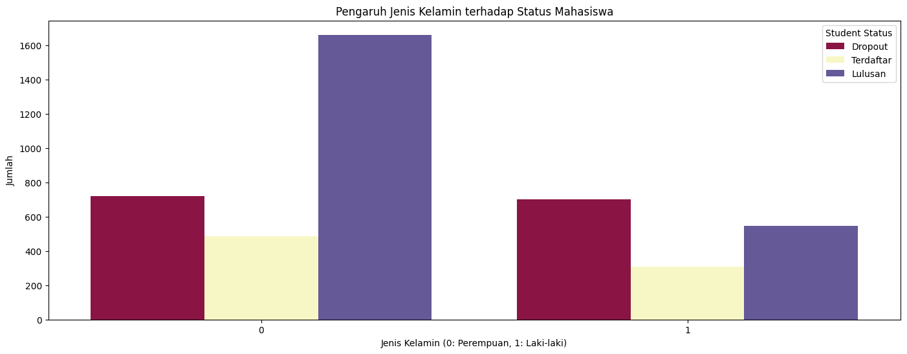

# **Laporan Proyek Machine Learning - Ridwan Setiawan**
## **Domain Proyek**
Prediksi dropout dan keberhasilan akademik mahasiswa adalah tantangan utama bagi institusi pendidikan tinggi di seluruh dunia. Dengan memahami faktor-faktor yang memengaruhi status akademik mahasiswa, institusi dapat melakukan intervensi dini untuk mengurangi tingkat putus kuliah dan mendukung keberhasilan akademik. Namun, salah satu hambatan terbesar dalam pengembangan model prediktif adalah ketidakseimbangan data, di mana kelas minoritas seperti mahasiswa dropout sering kali kurang terwakili, menyebabkan model bias terhadap kelas mayoritas seperti graduate atau enrolled.

Untuk mengatasi masalah ini, pendekatan berbasis machine learning diterapkan dengan memanfaatkan data akademik, demografis, dan sosial ekonomi mahasiswa. Teknik seperti Synthetic Minority Over-sampling Technique (SMOTE) digunakan untuk menyeimbangkan data, sementara algoritma seperti Gradient Boosting, Random Forest, dan Support Vector Machine (SVM) dieksplorasi untuk menghasilkan model prediktif yang akurat. Pendekatan ini bertujuan untuk membantu institusi pendidikan tidak hanya dalam memprediksi hasil akademik tetapi juga dalam meningkatkan strategi intervensi yang efektif.

### **Referensi**
- Martins, M.V., Tolledo, D., Machado, J., Baptista, L.M.T., Realinho, V. (2021). *Early Prediction of Student’s Performance in Higher Education: A Case Study*. In: Rocha, Á., Adeli, H., Dzemyda, G., Moreira, F., Ramalho Correia, A.M. (eds) Trends and Applications in Information Systems and Technologies. WorldCIST 2021. Advances in Intelligent Systems and Computing, vol 1365. Springer, Cham. https://doi.org/10.1007/978-3-030-72657-7_16.
- Villar, A., de Andrade, C.R.V. *Supervised Machine Learning Algorithms for Predicting Student Dropout and Academic Success*. Discov Artif Intell 4, 2 (2024). https://doi.org/10.1007/s44163-023-00079-z.
- Mduma, N. *Data Balancing Techniques for Predicting Student Dropout Using Machine Learning*. Data, 8(3), 49 (2023). https://doi.org/10.3390/data8030049.

## **Business Understanding**

### **Problem Statement**
Institusi pendidikan tinggi menghadapi tantangan untuk mengurangi tingkat dropout mahasiswa. Mahasiswa dropout tidak hanya kehilangan kesempatan pendidikan, tetapi institusi juga menghadapi kerugian finansial dan reputasi. Pendekatan berbasis machine learning diperlukan untuk memprediksi status akademik mahasiswa dan melakukan intervensi dini secara efektif.

### **Goals**
1. Mengembangkan model machine learning untuk memprediksi status akademik mahasiswa (Dropout, Enrolled, Graduate).
2. Mengidentifikasi model terbaik berdasarkan kinerja evaluasi dan efisiensi.
3. Mengurangi dimensi data untuk meningkatkan efisiensi pemrosesan dan mengurangi risiko overfitting.

### **Solution Statement**
1. **Algoritma yang Digunakan**:
   - Logistic Regression
   - K-Nearest Neighbors (KNN)
   - Support Vector Machine (SVM)
   - Random Forest
   - Gradient Boosting

   Model terbaik dipilih berdasarkan kinerja evaluasi pada data uji.

2. **Hyperparameter Tuning**:
   - Menggunakan **RandomizedSearchCV** untuk mengoptimalkan hyperparameter pada setiap algoritma.

3. **Evaluasi Model**:
   - Model dievaluasi berdasarkan metrik berikut:
     - **Training Score**: Mengukur akurasi model pada data pelatihan.
     - **Test Score**: Mengukur performa model pada data uji.
     - **Waktu Pelatihan**: Menilai efisiensi pelatihan model.
     - **Parameter Terbaik**: Hasil dari RandomizedSearchCV untuk memastikan performa optimal.

4. **Reduksi Dimensi dengan PCA**:
   - **Principal Component Analysis (PCA)** diterapkan untuk mengurangi jumlah fitur, meningkatkan efisiensi pemrosesan, dan meminimalkan risiko overfitting.

Solusi ini bertujuan untuk memilih model terbaik yang tidak hanya akurat tetapi juga efisien dalam prediksi status akademik mahasiswa.
## **3. Data Understanding**

### **Deskripsi Dataset**
Dataset ini mencakup data akademik, demografis, dan sosial ekonomi mahasiswa. Dataset memiliki **4,424 baris** dan **35 kolom**, dengan kolom target `Student Status` yang memiliki tiga kategori: Dropout (0), Enrolled (1), dan Graduate (2). Semua kolom dataset telah diubah menjadi numerik, kecuali untuk target yang di-encode menjadi kategori numerik.

### **Kondisi Data**
1. **Jumlah Baris dan Kolom**: Dataset terdiri dari 4,424 baris dan 35 kolom.
2. **Missing Value**: Tidak ada nilai yang hilang pada dataset.
3. **Duplikat**: Tidak ditemukan data duplikat.
4. **Outlier**: Outlier pada fitur numerik diidentifikasi melalui distribusi data, seperti `Age at Enrollment` dan `Curricular Units`.

### **Tautan Sumber Data**
Dataset diunduh dari UCI Machine Learning Repository:  
- **Judul Dataset**: Predict Students' Dropout and Academic Success  
- **Link Dataset**: [Predict Students' Dropout and Academic Success](https://archive.ics.uci.edu/dataset/697/predict+students+dropout+and+academic+success)

### **Informasi Fitur Dataset**
Berikut adalah informasi lengkap mengenai kolom dalam dataset:

| **Kolom**                                | **Tipe Data** | **Jumlah Data** | **Duplikat** | **Missing Value** | **Keterangan (Deskripsi dalam Bahasa Indonesia)**             |
|------------------------------------------|---------------|-----------------|--------------|-------------------|----------------------------------------------------------------|
| `Marital Status`                         | integer       | 4,424           | 0            | 0                 | Status perkawinan mahasiswa                                    |
| `Application Mode`                       | integer       | 4,424           | 0            | 0                 | Metode pendaftaran mahasiswa                                  |
| `Application Order`                      | integer       | 4,424           | 0            | 0                 | Urutan aplikasi mahasiswa                                      |
| `Course`                                 | integer       | 4,424           | 0            | 0                 | Program studi mahasiswa                                        |
| `Daytime/Evening Attendance`             | integer       | 4,424           | 0            | 0                 | Kehadiran mahasiswa (pagi/malam)                              |
| `Previous Qualification`                 | integer       | 4,424           | 0            | 0                 | Kualifikasi pendidikan sebelumnya                             |
| `Nationality`                            | integer       | 4,424           | 0            | 0                 | Kebangsaan mahasiswa                                          |
| `Mother's Qualification`                 | integer       | 4,424           | 0            | 0                 | Kualifikasi pendidikan ibu mahasiswa                          |
| `Father's Qualification`                 | integer       | 4,424           | 0            | 0                 | Kualifikasi pendidikan ayah mahasiswa                         |
| `Mother's Occupation`                    | integer       | 4,424           | 0            | 0                 | Pekerjaan ibu mahasiswa                                       |
| `Father's Occupation`                    | integer       | 4,424           | 0            | 0                 | Pekerjaan ayah mahasiswa                                      |
| `Displaced`                              | integer       | 4,424           | 0            | 0                 | Status merantau mahasiswa                                     |
| `Educational Special Needs`              | integer       | 4,424           | 0            | 0                 | Kebutuhan khusus pendidikan                                   |
| `Debtor`                                 | integer       | 4,424           | 0            | 0                 | Status mahasiswa sebagai penunggak pembayaran                |
| `Tuition Fees Up To Date`                | integer       | 4,424           | 0            | 0                 | Pembayaran uang kuliah tepat waktu                            |
| `Gender`                                 | integer       | 4,424           | 0            | 0                 | Jenis kelamin mahasiswa                                       |
| `Scholarship Holder`                     | integer       | 4,424           | 0            | 0                 | Status mahasiswa sebagai penerima beasiswa                   |
| `Age at Enrollment`                      | integer       | 4,424           | 0            | 0                 | Usia mahasiswa saat mendaftar                                 |
| `International`                          | integer       | 4,424           | 0            | 0                 | Status mahasiswa internasional                                |
| `Curricular Units 1st Sem (Credited)`    | integer       | 4,424           | 0            | 0                 | Jumlah mata kuliah disetujui di semester pertama              |
| `Curricular Units 1st Sem (Enrolled)`    | integer       | 4,424           | 0            | 0                 | Jumlah mata kuliah yang diambil di semester pertama           |
| `Curricular Units 1st Sem (Evaluations)` | integer       | 4,424           | 0            | 0                 | Jumlah evaluasi mata kuliah di semester pertama               |
| `Curricular Units 1st Sem (Approved)`    | integer       | 4,424           | 0            | 0                 | Jumlah mata kuliah lulus di semester pertama                  |
| `Curricular Units 1st Sem (Grade)`       | float         | 4,424           | 0            | 0                 | Nilai rata-rata mata kuliah di semester pertama               |
| `Curricular Units 2nd Sem (Credited)`    | integer       | 4,424           | 0            | 0                 | Jumlah mata kuliah disetujui di semester kedua                |
| `Curricular Units 2nd Sem (Enrolled)`    | integer       | 4,424           | 0            | 0                 | Jumlah mata kuliah yang diambil di semester kedua             |
| `Curricular Units 2nd Sem (Evaluations)` | integer       | 4,424           | 0            | 0                 | Jumlah evaluasi mata kuliah di semester kedua                 |
| `Curricular Units 2nd Sem (Approved)`    | integer       | 4,424           | 0            | 0                 | Jumlah mata kuliah lulus di semester kedua                    |
| `Curricular Units 2nd Sem (Grade)`       | float         | 4,424           | 0            | 0                 | Nilai rata-rata mata kuliah di semester kedua                 |
| `Unemployment Rate`                      | float         | 4,424           | 0            | 0                 | Tingkat pengangguran di daerah mahasiswa                      |
| `Inflation Rate`                         | float         | 4,424           | 0            | 0                 | Tingkat inflasi di daerah mahasiswa                           |
| `GDP`                                    | float         | 4,424           | 0            | 0                 | Produk Domestik Bruto di daerah mahasiswa                     |
| `Student Status`                         | integer       | 4,424           | 0            | 0                 | Status mahasiswa: Dropout (0), Enrolled (1), Graduate (2)     |

**Status Tabel**

Dataset ini telah diperiksa untuk **missing value**, **duplikasi**, dan **outlier**. Tidak ditemukan data yang hilang atau duplikat, dan fitur numerik telah dianalisis untuk outlier menggunakan distribusi statistik. Dataset ini siap untuk digunakan dalam proses machine learning dengan sedikit preprocessing tambahan, seperti reduksi dimensi menggunakan PCA.


____________________________________________________________________


## Domain Proyek

Prediksi dropout dan keberhasilan akademik mahasiswa merupakan tantangan penting yang dihadapi oleh institusi pendidikan tinggi di seluruh dunia. Tujuan utama dari institusi ini adalah menurunkan angka putus kuliah dan mendukung kesuksesan akademik guna meningkatkan hasil bagi individu mahasiswa dan kinerja institusi secara keseluruhan([1](https://repository.uinjkt.ac.id/dspace/handle/123456789/52120)). Dengan meningkatnya ketersediaan data mahasiswa yang mencakup faktor demografis, akademik, dan sosial ekonomi, penggunaan machine learning (ML) telah terbukti sebagai metode yang efektif untuk memprediksi hasil akademik ini. Namun, masalah utama yang dihadapi dalam pemodelan prediktif ini adalah ketidakseimbangan data (imbalanced data), di mana beberapa hasil (seperti "dropout") kurang terwakili dibandingkan dengan hasil lainnya (seperti "enrolled" atau "graduate"). Ketidakseimbangan ini dapat menyebabkan model menjadi bias terhadap kelas mayoritas dan mengurangi keakuratan prediksi untuk kelas minoritas yang sering kali menjadi fokus intervensi.

Penelitian terbaru menunjukkan pentingnya menangani masalah ketidakseimbangan data ini. Teknik seperti SMOTE (Synthetic Minority Over-sampling Technique) dan ADASYN (Adaptive Synthetic Sampling) telah terbukti meningkatkan performa model prediktif dengan cara menghasilkan sampel sintetik untuk kelas yang kurang terwakili. Pendekatan ini memungkinkan model dilatih pada dataset yang lebih seimbang, sehingga meningkatkan kemampuan model dalam memprediksi mahasiswa yang berpotensi putus kuliah, yang umumnya merupakan kelas minoritas dalam dataset akademik​(
[2](https://www.mdpi.com/2306-5729/7/11/146)
)​(
[3](https://link.springer.com/article/10.1007/s44163-023-00079-z)
).

Dalam laporan ini, kami menyajikan hasil pemodelan prediktif yang diterapkan pada dataset dengan tiga kemungkinan hasil bagi mahasiswa: dropout, enrolled, dan graduate. Performa berbagai model machine learning seperti Gradient Boosting, Random Forest, SVM, K-Nearest Neighbors (KNN), Logistic Regression, dan XGBoost dioptimalkan dengan mengidentifikasi ambang keputusan terbaik untuk setiap kelas. Selain itu, laporan ini juga membahas potensi penggunaan ensemble learning untuk lebih meningkatkan akurasi prediksi, terutama untuk kelas minoritas seperti "dropout," yang sering kali memiliki akurasi prediksi lebih rendah karena ketidak seimbangan data​(
[4](https://www.mdpi.com/2227-7102/9/4/275)
)​(
[5](https://www.mdpi.com/2306-5729/8/3/49)
).

Hasil studi ini berkontribusi pada tujuan yang lebih luas dari institusi pendidikan untuk melaksanakan intervensi proaktif, mendukung mahasiswa yang berisiko, dan meningkatkan keberhasilan akademik secara keseluruhan.

## Business Understanding

### Problem Statements

Tujuan utama dari proyek ini adalah untuk memprediksi status akademik mahasiswa, khususnya mengidentifikasi mahasiswa yang berisiko dropout dan mendukung keberhasilan akademik mereka.

Dengan memahami faktor-faktor yang berkontribusi terhadap dropout dan keberhasilan akademik, institusi pendidikan tinggi dapat melakukan intervensi proaktif, memberikan dukungan yang tepat kepada mahasiswa yang membutuhkan, dan meningkatkan angka kelulusan secara keseluruhan.

1. Bagaimana mempersiapkan data buku, pengguna, dan _rating_ agar dapat digunakan sebagai informasi untuk membuat model _machine learning_ sistem rekomendasi?
2. Bagaimana cara membuat model _machine learning_ untuk sistem rekomendasi buku yang baik?

### Permasalahan Bisnis

Institusi pendidikan tinggi dihadapkan pada tantangan dalam mengurangi angka dropout dan meningkatkan keberhasilan akademik mahasiswa. Dropout memiliki dampak negatif yang signifikan, baik bagi individu mahasiswa maupun institusi. Mahasiswa yang dropout kehilangan kesempatan untuk menyelesaikan pendidikan mereka dan meraih potensi penuh mereka, sedangkan institusi mengalami kerugian finansial dan penurunan reputasi.

Permasalahan yang ingin diatasi:

1.  Identifikasi dini mahasiswa yang berisiko dropout.
2.  Pemahaman faktor-faktor yang berkontribusi terhadap dropout dan keberhasilan akademik.
3.  Pengembangan model prediktif yang akurat untuk memprediksi status akademik mahasiswa.

### Solusi yang Diusulkan

1. Mengumpulkan dan membersihkan data mahasiswa yang relevan.
2. Menganalisis data untuk mengidentifikasi faktor-faktor risiko dan prediktor keberhasilan akademik.
3. Mengembangkan model ML untuk memprediksi status akademik mahasiswa (Dropout, Enrolled, Graduate).
4. Mengevaluasi performa model.

### Solution Statement

Untuk mencapai tujuan proyek, langkah-langkah berikut akan dilakukan:

1.  Data Loading
2.  Data Understanding
3.  Exploratory Data Analysis (EDA)
4.  Data preparation
5.  Model Development
6.  Evaluasi Model

## Data Loading

Deskripsi Data:
Sumber Data: Kaggle

Judul: Predict Students' Dropout and Academic Success

Link: https://archive.ics.uci.edu/dataset/697/predict+students+dropout+and+academic+success

**Memuat Data dan Pra-pemrosesan**

Langkah dasar ini melibatkan pemuatan dataset dan persiapannya untuk analisis. Ini sangat penting untuk memastikan kebersihan dan struktur dataset yang mendukung pembangunan model yang akurat. Dengan membersihkan dan memproses data secara teliti, kita meletakkan dasar untuk pemodelan pembelajaran mesin yang kuat.

**Mengimpor Perpustakaan yang Diperlukan**

Perpustakaan penting seperti Pandas dan NumPy diimpor untuk manipulasi data, sementara Matplotlib dan Seaborn digunakan untuk visualisasi data. Perpustakaan ini menawarkan berbagai fungsi yang menyederhanakan analisis data dan representasi grafis dari data.

```
# Mengimpor pustaka penting untuk manipulasi data (Pandas, NumPy) dan visualisasi (Matplotlib, Seaborn)

import pandas as pd
import numpy as np
import matplotlib.pyplot as plt
import seaborn as sns
from google.colab import drive
drive.mount('/content/drive')
```

```
# Memuat Data Ulasan dari File CSV
csv_path = '/content/drive/My Drive/Colab Notebooks/Research/dataset.csv'
df = pd.read_csv(csv_path)

# Tampilkan sample Baris Data
df.head()
```

```
Drive already mounted at /content/drive; to attempt to forcibly remount, call drive.mount("/content/drive", force_remount=True).
```

| Marital status | Application mode | Application order | Course | Daytime/evening attendance | Previous qualification | Nacionality | Mother's qualification | Father's qualification | Mother's occupation | Curricular units 2nd sem (credited) | Curricular units 2nd sem (enrolled) | Curricular units 2nd sem (evaluations) | Curricular units 2nd sem (approved) | Curricular units 2nd sem (grade) | Curricular units 2nd sem (without evaluations) | Unemployment rate | Inflation rate | GDP   | Target   |
| -------------- | ---------------- | ----------------- | ------ | -------------------------- | ---------------------- | ----------- | ---------------------- | ---------------------- | ------------------- | ----------------------------------- | ----------------------------------- | -------------------------------------- | ----------------------------------- | -------------------------------- | ---------------------------------------------- | ----------------- | -------------- | ----- | -------- |
| 1              | 8                | 5                 | 2      | 1                          | 1                      | 1           | 13                     | 10                     | 6                   | 0                                   | 0                                   | 0                                      | 0                                   | 0.000000                         | 0                                              | 10.8              | 1.4            | 1.74  | Dropout  |
| 1              | 6                | 1                 | 11     | 1                          | 1                      | 1           | 1                      | 3                      | 4                   | 0                                   | 6                                   | 6                                      | 6                                   | 13.666667                        | 0                                              | 13.9              | -0.3           | 0.79  | Graduate |
| 1              | 1                | 5                 | 5      | 1                          | 1                      | 1           | 22                     | 27                     | 10                  | 0                                   | 6                                   | 0                                      | 0                                   | 0.000000                         | 0                                              | 10.8              | 1.4            | 1.74  | Dropout  |
| 1              | 8                | 2                 | 15     | 1                          | 1                      | 1           | 23                     | 27                     | 6                   | 0                                   | 6                                   | 10                                     | 5                                   | 12.400000                        | 0                                              | 9.4               | -0.8           | -3.12 | Graduate |
| 2              | 12               | 1                 | 3      | 0                          | 1                      | 1           | 22                     | 28                     | 10                  | 0                                   | 6                                   | 6                                      | 6                                   | 13.000000                        | 0                                              | 13.9              | -0.3           | 0.79  | Graduate |

**Deskripsi Data**
Dataset yang digunakan dalam penelitian ini terdiri dari 37 kolom, dengan 36 kolom berperan sebagai fitur dan 1 kolom sebagai target, yaitu 'Student Status'. Semua data dalam dataset ini sudah dalam format numerik, yang memudahkan proses analisis dan pemodelan machine learning. Adapun untuk nama setiap fitur dan target yang ada sebagai berikut:

1.  Marital Status (Status Perkawinan);
2.  Application mode (Mode Pendaftaran);
3.  Application order (Urutan Pendaftaran);
4.  Course (Program Studi);
5.  Daytime/evening attendance (Waktu Kehadiran Siang/Malam);
6.  Previous qualification (Kualifikasi Sebelumnya);
7.  Nacionality (Kewarganegaraan);
8.  Mother's qualification (Kualifikasi Ibu);
9.  Father's qualification (Kualifikasi Ayah);
10. Mother's occupation (Pekerjaan Ibu);
11. Father's occupation (Pekerjaan Ayah);
12. Displaced (Merantau);
13. Educational special needs (Kebutuhan Khusus Pendidikan);
14. Debtor (Penunggak Pembayaran);
15. Tuition fees up to date (Pembayaran Uang Kuliah Tepat Waktu);
16. Gender (Jenis Kelamin);
17. Scholarship holder (Penerima Beasiswa);
18. Age at enrollment (Usia Saat Pendaftaran);
19. International (Mahasiswa Internasional);
20. Curricular units 1st sem (credited) (Jumlah SKS Disetujui Semester 1);
21. Curricular units 1st sem (enrolled) (Jumlah SKS Terdaftar Semester 1);
22. Curricular units 1st sem (evaluations) (Jumlah Evaluasi SKS Semester 1);
23. Curricular units 1st sem (approved) (Jumlah SKS Lulus Semester 1);
24. Curricular units 1st sem (grade) (Nilai Rata-Rata Semester 1);
25. Curricular units 1st sem (without evaluations) (Jumlah SKS Tanpa Evaluasi Semester 1);
26. Curricular units 2nd sem (credited) (Jumlah SKS Disetujui Semester 2);
27. Curricular units 2nd sem (enrolled) (Jumlah SKS Terdaftar Semester 2);
28. Curricular units 2nd sem (evaluations) (Jumlah Evaluasi SKS Semester 2);
29. Curricular units 2nd sem (approved) (Jumlah SKS Lulus Semester 2);
30. Curricular units 2nd sem (grade) (Nilai Rata-Rata Semester 2);
31. Curricular units 2nd sem (without evaluations) (Jumlah SKS Tanpa Evaluasi Semester 2);
32. Unemployment rate (Tingkat Pengangguran);
33. Inflation rate (Tingkat Inflasi); 34. GDP (Produk Domestik Bruto);
34. Target (Target).

Penggantian nama kolom dalam dataset bertujuan untuk meningkatkan keterbacaan dan konsistensi dalam analisis data. Dalam kasus ini, nama kolom yang semula **'Nacionality'** diganti menjadi **'Nationality'** untuk memperbaiki kesalahan ejaan dan menyesuaikannya dengan standar penulisan bahasa Inggris yang lebih umum digunakan. Perubahan ini penting agar nama kolom lebih mudah dipahami oleh pengguna dan sejalan dengan standar internasional.

Selain itu, kolom **'Target'** diubah menjadi 'Student Status' untuk memberikan deskripsi yang lebih jelas mengenai isi dari kolom tersebut. 'Target' adalah istilah yang terlalu umum, sedangkan 'Student Status' secara spesifik menjelaskan bahwa kolom tersebut berisi status akhir mahasiswa, apakah mereka Graduate (lulus), Enroled (masih terdaftar), atau Dropout (berhenti). Penggunaan nama kolom yang lebih deskriptif ini membantu memudahkan interpretasi dan analisis data.

```
# Mengganti nama kolom 'Nacionality' menjadi 'Nationality' dan 'Target' menjadi 'Student Status'
df.rename(columns = {'Nacionality':'Nationality', 'Target': 'Student Status'}, inplace = True)
```

```
# Melihat dimensi dataset (jumlah total baris dan kolom)
df.shape
```

```
(4424, 35)
```

Dataset ini terdiri dari 4.424 baris dan 35 kolom, di mana setiap baris mewakili seorang mahasiswa, dan kolom-kolomnya berisi berbagai variabel terkait data demografis, akademik, dan faktor eksternal yang relevan untuk analisis status akademik mahasiswa.

```
# Menampilkan ringkasan tipe data setiap kolom dan nilai non-null dalam dataframe
df.info()
```

<class 'pandas.core.frame.DataFrame'>
RangeIndex: 4424 entries, 0 to 4423
Data columns (total 35 columns):

```
 #   Column                                          Non-Null Count  Dtype
---  ------                                          --------------  -----
 0   Marital status                                  4424 non-null   int64
 1   Application mode                                4424 non-null   int64
 2   Application order                               4424 non-null   int64
 3   Course                                          4424 non-null   int64
 4   Daytime/evening attendance                      4424 non-null   int64
 5   Previous qualification                          4424 non-null   int64
 6   Nationality                                     4424 non-null   int64
 7   Mother's qualification                          4424 non-null   int64
 8   Father's qualification                          4424 non-null   int64
 9   Mother's occupation                             4424 non-null   int64
 10  Father's occupation                             4424 non-null   int64
 11  Displaced                                       4424 non-null   int64
 12  Educational special needs                       4424 non-null   int64
 13  Debtor                                          4424 non-null   int64
 14  Tuition fees up to date                         4424 non-null   int64
 15  Gender                                          4424 non-null   int64
 16  Scholarship holder                              4424 non-null   int64
 17  Age at enrollment                               4424 non-null   int64
 18  International                                   4424 non-null   int64
 19  Curricular units 1st sem (credited)             4424 non-null   int64
 20  Curricular units 1st sem (enrolled)             4424 non-null   int64
 21  Curricular units 1st sem (evaluations)          4424 non-null   int64
 22  Curricular units 1st sem (approved)             4424 non-null   int64
 23  Curricular units 1st sem (grade)                4424 non-null   float64
 24  Curricular units 1st sem (without evaluations)  4424 non-null   int64
 25  Curricular units 2nd sem (credited)             4424 non-null   int64
 26  Curricular units 2nd sem (enrolled)             4424 non-null   int64
 27  Curricular units 2nd sem (evaluations)          4424 non-null   int64
 28  Curricular units 2nd sem (approved)             4424 non-null   int64
 29  Curricular units 2nd sem (grade)                4424 non-null   float64
 30  Curricular units 2nd sem (without evaluations)  4424 non-null   int64
 31  Unemployment rate                               4424 non-null   float64
 32  Inflation rate                                  4424 non-null   float64
 33  GDP                                             4424 non-null   float64
 34  Student Status                                  4424 non-null   object
dtypes: float64(5), int64(29), object(1)
memory usage: 1.2+ MB
```

Dataset ini berisi total 4.424 entri dengan 35 kolom. Semua kolom memiliki nilai yang lengkap (non-null), tanpa data yang hilang. Dari 35 kolom, 29 di antaranya memiliki tipe data int64 (numerik integer), 5 kolom bertipe float64 (numerik desimal), dan 1 kolom bertipe object, yang merupakan kolom kategori (Student Status).
Data numerik merupakan fondasi penting dalam machine learning karena sebagian besar algoritma machine learning dirancang untuk memproses data numerik secara langsung dan efisien[6](https://www.academia.edu/43840124/Hands_On_Machine_Learning_with_Scikit_Learn_Keras_and_TensorFlow_SECOND_EDITION_Concepts_Tools_and_Techniques_to_Build_Intelligent_Systems). Algoritma ini menggunakan operasi matematika untuk menemukan pola dalam data dan membuat prediksi, sehingga data numerik, yang secara alami merepresentasikan informasi kuantitatif, menjadi sangat kompatibel[6](https://www.academia.edu/43840124/Hands_On_Machine_Learning_with_Scikit_Learn_Keras_and_TensorFlow_SECOND_EDITION_Concepts_Tools_and_Techniques_to_Build_Intelligent_Systems). Data numerik juga memungkinkan perhitungan yang lebih cepat dan memudahkan penerapan metode statistik untuk analisis data, memberikan wawasan berharga tentang pola dan hubungan dalam data[6](https://www.academia.edu/43840124/Hands_On_Machine_Learning_with_Scikit_Learn_Keras_and_TensorFlow_SECOND_EDITION_Concepts_Tools_and_Techniques_to_Build_Intelligent_Systems). Oleh karena itu, penggunaan data numerik dalam project machine learning sangat penting untuk mencapai hasil yang optimal.

```
# Menampilkan jumlah nilai yang hilang (missing values) per kolom
print("Jumlah nilai yang hilang per kolom:\n", df.isnull().sum())
```

```
Jumlah nilai yang hilang per kolom:
Marital status                                    0
Application mode                                  0
Application order                                 0
Course                                            0
Daytime/evening attendance                        0
Previous qualification                            0
Nationality                                       0
Mother's qualification                            0
Father's qualification                            0
Mother's occupation                               0
Father's occupation                               0
Displaced                                         0
Educational special needs                         0
Debtor                                            0
Tuition fees up to date                           0
Gender                                            0
Scholarship holder                                0
Age at enrollment                                 0
International                                     0
Curricular units 1st sem (credited)               0
Curricular units 1st sem (enrolled)               0
Curricular units 1st sem (evaluations)            0
Curricular units 1st sem (approved)               0
Curricular units 1st sem (grade)                  0
Curricular units 1st sem (without evaluations)    0
Curricular units 2nd sem (credited)               0
Curricular units 2nd sem (enrolled)               0
Curricular units 2nd sem (evaluations)            0
Curricular units 2nd sem (approved)               0
Curricular units 2nd sem (grade)                  0
Curricular units 2nd sem (without evaluations)    0
Unemployment rate                                 0
Inflation rate                                    0
GDP                                               0
Student Status                                    0
dtype: int64
```

Dalam analisis dataset ini, tidak ditemukan nilai yang hilang pada seluruh kolom. Kondisi ini mempermudah proses pra-pemrosesan data, karena tidak diperlukan teknik imputasi atau penghapusan data yang dapat memperkenalkan bias atau mengurangi akurasi model prediksi. Ketiadaan nilai hilang juga memungkinkan model machine learning dilatih secara efisien, menghindari kesalahan prediksi yang sering muncul dalam dataset tidak lengkap​(
[7](https://link.springer.com/article/10.1007/s41060-021-00259-z)
)​(
[8](https://journalofbigdata.springeropen.com/articles/10.1186/s40537-021-00516-9)
).

```
# Menampilkan jumlah nilai duplikat per kolom
print("Jumlah nilai duplikat per kolom:\n", df.duplicated().sum())
```

```
Jumlah nilai duplikat per kolom:
 0
```

```
# Menampilkan nilai unik di kolom 'Student Status' yang masih dalam format non-numerik
print(df["Student Status"].unique())
```

```
['Dropout' 'Graduate' 'Enrolled']
```

Hasil pemeriksaan nilai unik pada kolom 'Student Status' yang masih dalam format non-numerik menunjukkan tiga kategori utama: 'Dropout', 'Graduate', dan 'Enrolled'. Kategori ini menggambarkan status akhir mahasiswa dalam dataset—apakah mereka keluar dari program (Dropout), melanjutkan studi (Enrolled), atau telah lulus (Graduate).

```
# Mengubah nilai 'Student Status' ke dalam format numerik agar dapat digunakan oleh algoritma machine learning
# 'Dropout' diubah menjadi 0, 'Enrolled' menjadi 1, dan 'Graduate' menjadi 2
df['Student Status'] = df['Student Status'].map({'Dropout' : 0, 'Enrolled': 1, 'Graduate': 2})
```

**Label encoding** adalah teknik yang digunakan untuk mengonversi nilai kategori non-numerik menjadi representasi numerik, agar dapat diproses oleh algoritma machine learning[10](https://arxiv.org/pdf/2303.02273). Dalam hal ini, nilai pada kolom 'Student Status' diubah dari format teks menjadi angka: **'Dropout' menjadi 0, 'Enrolled' menjadi 1, dan 'Graduate' menjadi 2**. Konversi ini memungkinkan model machine learning untuk melakukan klasifikasi multikelas dengan lebih efisien. Teknik ini sangat umum digunakan untuk menyederhanakan data kategorikal sehingga algoritma dapat memahami dan memprosesnya secara langsung​

```
# Menampilkan nilai unik di kolom 'Student Status' setelah diubah ke format numerik
print(df["Student Status"].unique())
```

```
[0 2 1]
```

## Exploratory Data Analysis (EDA)

Dalam penelitian ini, koefisien korelasi Spearman digunakan untuk mengukur asosiasi antar variabel karena keunggulannya dalam menangani data ordinal, data tidak berdistribusi normal, dan hubungan non-linier yang mungkin terdapat dalam dataset. Korelasi Spearman, sebagai ukuran non-parametrik, lebih robust terhadap outlier dan memberikan hasil yang lebih akurat dalam kondisi tersebut dibandingkan dengan korelasi Pearson yang mengasumsikan data interval/rasio dan distribusi normal[10](https://www.preprints.org/manuscript/202312.1604). Oleh karena itu, penggunaan korelasi Spearman diyakini lebih tepat untuk menganalisis hubungan antar variabel dalam penelitian ini, menghasilkan interpretasi yang lebih valid dan handal.

```
# Menghitung korelasi antara kolom-kolom dengan 'Student Status'
df.corr()['Student Status']
```

```
                                                 Student Status
|------------------------------------------------|------------|
| Marital status                                 | -0.089804  |
| Application mode                               | -0.212025  |
| Application order                              | 0.089791   |
| Course                                         | 0.007841   |
| Daytime/evening attendance                     | 0.075107   |
| Previous qualification                         | -0.091365  |
| Nationality                                    | -0.004740  |
| Mother's qualification                         | -0.038346  |
| Father's qualification                         | 0.000329   |
| Mother's occupation                            | 0.048424   |
| Father's occupation                            | 0.051702   |
| Displaced                                      | 0.113986   |
| Educational special needs                      | -0.007353  |
| Debtor                                         | -0.240999  |
| Tuition fees up to date                        | 0.409827   |
| Gender                                         | -0.229270  |
| Scholarship holder                             | 0.297595   |
| Age at enrollment                              | -0.243438  |
| International                                  | 0.003934   |
| Curricular units 1st sem (credited)            | 0.048150   |
| Curricular units 1st sem (enrolled)            | 0.155974   |
| Curricular units 1st sem (evaluations)         | 0.044362   |
| Curricular units 1st sem (approved)            | 0.529123   |
| Curricular units 1st sem (grade)               | 0.485207   |
| Curricular units 1st sem (without evaluations) | -0.068702  |
| Curricular units 2nd sem (credited)            | 0.054004   |
| Curricular units 2nd sem (enrolled)            | 0.175847   |
| Curricular units 2nd sem (evaluations)         | 0.092721   |
| Curricular units 2nd sem (approved)            | 0.624157   |
| Curricular units 2nd sem (grade)               | 0.566827   |
| Curricular units 2nd sem (without evaluations) | -0.094028  |
| Unemployment rate                              | 0.008627   |
| Inflation rate                                 | -0.026874  |
| GDP                                            | 0.044135   |
| Student Status                                 | 1.000000   |

```

Berdasarkan hasil perhitungan korelasi antara variabel dalam dataset dengan 'Student Status', berikut adalah **lima variabel dengan korelasi positif dan lima variabel dengan korelasi negatif** yang paling signifikan:

**Korelasi Positif Tertinggi**:

1.  **Curricular units 2nd sem (approved): 0.624**
    Ini menunjukkan bahwa semakin banyak mata kuliah yang disetujui di semester kedua, semakin besar kemungkinan mahasiswa akan lulus.
1.  **Curricular units 2nd sem (grade): 0.567**
    Nilai rata-rata di semester kedua juga memiliki korelasi kuat dengan kelulusan, menunjukkan bahwa performa akademik semester kedua berperan penting.
1.  **Curricular units 1st sem (approved): 0.529**
    Jumlah mata kuliah yang disetujui di semester pertama juga berhubungan positif dengan keberhasilan akademik.
1.  **Curricular units 1st sem (grade): 0.485**
    Nilai rata-rata di semester pertama memberikan kontribusi yang signifikan terhadap status akademik mahasiswa.
1.  **Tuition fees up to date: 0.410**
    Mahasiswa yang membayar biaya kuliah tepat waktu cenderung lebih mungkin untuk menyelesaikan studi mereka.

**Korelasi Negatif Tertinggi:**

1.  **Age at enrollment: -0.243**
    Usia mahasiswa saat mendaftar memiliki hubungan negatif dengan kelulusan, di mana mahasiswa yang lebih tua cenderung memiliki peluang yang lebih rendah untuk lulus.
1.  **Debtor: -0.241**
    Mahasiswa yang memiliki utang cenderung memiliki kemungkinan yang lebih rendah untuk menyelesaikan pendidikan mereka.
1.  **Gender: -0.229**
    Korelasi ini menunjukkan adanya hubungan negatif antara jenis kelamin dengan status akademik, yang mungkin mengindikasikan perbedaan gender dalam pencapaian akademik.
1.  **Application mode: -0.212**
    Modus aplikasi mahasiswa juga memiliki hubungan negatif dengan kelulusan, yang mungkin disebabkan oleh jenis jalur pendaftaran yang diikuti mahasiswa.
1.  **Previous qualification: -0.091**
    Kualifikasi pendidikan sebelumnya mahasiswa menunjukkan korelasi negatif ringan dengan kelulusan, yang dapat mengindikasikan bahwa latar belakang pendidikan tertentu kurang mendukung kesuksesan di perguruan tinggi.

```
# Menghitung Korelasi Peringkat Spearman (Spearman's Rank Correlation)
spearman_corr = df.corr(method='spearman')['Student Status'].sort_values(ascending=False)

# Menampilkan Korelasi Peringkat Spearman
print("Korelasi Peringkat Spearman dengan Student Status:")
print(spearman_corr)
```

```
Korelasi Peringkat Spearman dengan Student Status:
Student Status                                    1.000000
Curricular units 2nd sem (approved)               0.654049
Curricular units 1st sem (approved)               0.594194
Curricular units 2nd sem (grade)                  0.559820
Curricular units 1st sem (grade)                  0.497341
Tuition fees up to date                           0.400283
Scholarship holder                                0.301103
Curricular units 2nd sem (enrolled)               0.241456
Curricular units 1st sem (enrolled)               0.230576
Displaced                                         0.113241
Application order                                 0.102185
Daytime/evening attendance                        0.073066
GDP                                               0.053497
Curricular units 2nd sem (credited)               0.035004
Mother's occupation                               0.032700
Father's occupation                               0.032265
Curricular units 2nd sem (evaluations)            0.028444
Father's qualification                            0.024058
Curricular units 1st sem (credited)               0.019971
Unemployment rate                                 0.016378
Course                                            0.014122
International                                     0.002860
Nationality                                       0.002535
Educational special needs                        -0.007953
Mother's qualification                           -0.018999
Inflation rate                                   -0.022259
Curricular units 1st sem (evaluations)           -0.027602
Curricular units 1st sem (without evaluations)   -0.081031
Curricular units 2nd sem (without evaluations)   -0.089313
Marital status                                   -0.103578
Previous qualification                           -0.125939
Application mode                                 -0.214098
Gender                                           -0.229616
Debtor                                           -0.239002
Age at enrollment                                -0.284946
Name: Student Status, dtype: float64
```

Berdasarkan hasil perhitungan korelasi Peringkat Spearman, beberapa variabel menunjukkan hubungan yang kuat dengan **'Student Status'**. Korelasi Spearman digunakan untuk mengukur hubungan monoton antara variabel, di mana nilai korelasi yang lebih tinggi menunjukkan hubungan yang lebih kuat.

### Korelasi Positif Tertinggi:

1. **Curricular units 2nd sem (approved)**: 0.654  
   Semakin banyak mata kuliah yang disetujui di semester kedua, semakin besar kemungkinan mahasiswa akan lulus.
2. **Curricular units 1st sem (approved)**: 0.594  
   Jumlah mata kuliah yang disetujui di semester pertama juga berkorelasi kuat dengan kelulusan.

3. **Curricular units 2nd sem (grade)**: 0.560  
   Nilai rata-rata di semester kedua sangat berkorelasi positif dengan status akademik.

4. **Curricular units 1st sem (grade)**: 0.497  
   Nilai rata-rata semester pertama juga berperan penting dalam menentukan status akademik mahasiswa.

5. **Tuition fees up to date**: 0.400  
   Kepatuhan pembayaran biaya kuliah berhubungan positif dengan kemungkinan kelulusan.

### Korelasi Negatif Tertinggi:

1. **Age at enrollment**: -0.285  
   Usia saat pendaftaran memiliki korelasi negatif signifikan dengan kelulusan, di mana mahasiswa yang lebih tua cenderung memiliki peluang lebih rendah untuk lulus.

2. **Debtor**: -0.239  
   Mahasiswa yang memiliki utang lebih cenderung tidak menyelesaikan studi mereka.

3. **Gender**: -0.230  
   Terdapat perbedaan yang signifikan terkait gender dalam pencapaian akademik.

4. **Application mode**: -0.214  
   Modus aplikasi juga berkorelasi negatif dengan kelulusan, yang mungkin disebabkan oleh jalur pendaftaran yang diikuti mahasiswa.

5. **Marital status**: -0.104  
   Status perkawinan memiliki korelasi negatif dengan hasil akademik mahasiswa.

### Reduksi Dimensi (Dimensionality Reduction)\*\*

Untuk meningkatkan efisiensi dalam analisis dan pembuatan model machine learning, beberapa kolom dihapus dari dataset. Kolom-kolom ini dipilih karena tidak memberikan kontribusi signifikan terhadap analisis atau prediksi [11](https://ieeexplore.ieee.org/abstract/document/10393948/). Berikut adalah beberapa kategori kolom yang dihapus:

-   **Data Demografis**: Kolom seperti **Nationality**, **International**, dan **GDP** dihapus karena dianggap tidak memiliki hubungan langsung dengan hasil akademik mahasiswa.
-   **Kualifikasi dan Pekerjaan Orang Tua**: Kolom **Mother's qualification**, **Father's qualification**, serta **occupations** mereka tidak menunjukkan korelasi kuat dengan **Student Status**.
-   **Informasi Akademik Tertentu**: Kolom seperti **Curricular units 1st sem (credited)** dan **evaluations** dihapus karena korelasinya yang rendah dengan hasil akhir mahasiswa.
-   **Indikator Ekonomi**: Kolom seperti **Unemployment rate**, **Inflation rate**, dan **GDP** tidak memberikan kontribusi signifikan pada pembuatan model prediktif.

```
# Menghapus kolom yang tidak diperlukan karena tidak berkontribusi pada analisis atau pembuatan model
df = df.drop(columns=['Nationality', 'International', 'Educational special needs', 'Course',
                      'Mother\'s qualification','Father\'s qualification',
                      'Mother\'s occupation', 'Father\'s occupation',
                      'Curricular units 1st sem (credited)', 'Curricular units 1st sem (evaluations)',
                      'Unemployment rate', 'Inflation rate', 'GDP'], axis=1)
df.head()
```

| Marital status | Application mode | Application order | Daytime/evening attendance | Previous qualification | Displaced | Debtor | Tuition fees up to date | Gender | Scholarship holder | Curricular units 1st sem (approved) | Curricular units 1st sem (grade) | Curricular units 1st sem (without evaluations) | Curricular units 2nd sem (credited) | Curricular units 2nd sem (enrolled) | Curricular units 2nd sem (evaluations) | Curricular units 2nd sem (approved) | Curricular units 2nd sem (grade) | Curricular units 2nd sem (without evaluations) | Student Status |
| -------------- | ---------------- | ----------------- | -------------------------- | ---------------------- | --------- | ------ | ----------------------- | ------ | ------------------ | ----------------------------------- | -------------------------------- | ---------------------------------------------- | ----------------------------------- | ----------------------------------- | -------------------------------------- | ----------------------------------- | -------------------------------- | ---------------------------------------------- | -------------- |
| 1              | 8                | 5                 | 1                          | 1                      | 1         | 0      | 1                       | 1      | 0                  | 0                                   | 0.000000                         | 0                                              | 0                                   | 0                                   | 0                                      | 0                                   | 0.000000                         | 0                                              | 0              |
| 1              | 6                | 1                 | 1                          | 1                      | 1         | 0      | 0                       | 1      | 0                  | 6                                   | 14.000000                        | 0                                              | 0                                   | 6                                   | 6                                      | 6                                   | 13.666667                        | 0                                              | 2              |
| 1              | 1                | 5                 | 1                          | 1                      | 1         | 0      | 0                       | 1      | 0                  | 0                                   | 0.000000                         | 0                                              | 0                                   | 6                                   | 0                                      | 0                                   | 0.000000                         | 0                                              | 0              |
| 1              | 8                | 2                 | 1                          | 1                      | 1         | 0      | 1                       | 0      | 0                  | 6                                   | 13.428571                        | 0                                              | 0                                   | 6                                   | 10                                     | 5                                   | 12.400000                        | 0                                              | 2              |
| 2              | 12               | 1                 | 0                          | 1                      | 0         | 0      | 1                       | 0      | 0                  | 5                                   | 12.333333                        | 0                                              | 0                                   | 6                                   | 6                                      | 6                                   | 13.000000                        | 0                                              | 2              |

### Feature Engineering

Dalam proses pembuatan model prediksi berbasis **machine learning**, salah satu langkah penting adalah pembuatan fitur yang dapat menangkap hubungan yang lebih kompleks antara variabel. Pada tahap ini, dilakukan pembuatan **fitur interaksi** dan **fitur agregat** untuk memodelkan kinerja akademik mahasiswa. Fitur interaksi dibangun dengan mengalikan nilai dari dua semester, sementara fitur agregat dibuat dengan menjumlahkan atau merata-ratakan nilai antar semester. Langkah ini sering dilakukan untuk membantu model machine learning menangkap pola yang tidak terdeteksi dari fitur individual [13](https://www.mdpi.com/2076-3417/12/15/7494).

Pembuatan **fitur interaksi** bertujuan untuk mengukur dampak kombinasi dari dua variabel. Dalam hal ini, kinerja akademik semester pertama dan kedua mahasiswa dikombinasikan untuk menghasilkan dua fitur baru: **Interaction_CU_1st_2nd_Approved** (mengalikan jumlah mata kuliah yang disetujui) dan **Interaction_CU_1st_2nd_Grade** (mengalikan nilai rata-rata antar semester).

Selain itu, dibuat juga **fitur agregat**, di mana jumlah mata kuliah yang disetujui di semester pertama dan kedua dijumlahkan menjadi **Total_CU_Approved**, dan nilai rata-rata antar semester dihitung sebagai **Total_CU_Grade**.

Langkah terakhir adalah **penghapusan fitur asli** untuk menghindari **multikolinearitas**, yaitu kondisi di mana dua atau lebih variabel sangat berkorelasi, yang dapat merusak performa model prediksi. Dengan menghapus fitur asli seperti nilai dan jumlah mata kuliah yang disetujui di setiap semester, model dapat bekerja lebih efisien tanpa redundansi informasi yang berpotensi mengganggu hasil prediksi.

```
# Membuat fitur interaksi untuk kinerja akademik (mengalikan nilai-nilai antar semester)
df['Interaction_CU_1st_2nd_Approved'] = df['Curricular units 1st sem (approved)'] * df['Curricular units 2nd sem (approved)']
df['Interaction_CU_1st_2nd_Grade'] = df['Curricular units 1st sem (grade)'] * df['Curricular units 2nd sem (grade)']

# Membuat fitur agregat untuk kinerja total
df['Total_CU_Approved'] = df['Curricular units 1st sem (approved)'] + df['Curricular units 2nd sem (approved)']
df['Total_CU_Grade'] = (df['Curricular units 1st sem (grade)'] + df['Curricular units 2nd sem (grade)']) / 2

# Menghapus fitur asli untuk mengurangi masalah multikolinearitas
columns_to_drop = ['Curricular units 1st sem (approved)', 'Curricular units 2nd sem (approved)',
                   'Curricular units 1st sem (grade)', 'Curricular units 2nd sem (grade)',]
df.drop(columns_to_drop, axis=1, inplace=True)
```

```
df.head()
```

| Marital Status | Application Mode | Application Order | Daytime/Evening Attendance | Previous Qualification | Displaced | Debtor | Tuition Fees Up to Date | Gender | Scholarship Holder | ... | Curricular Units 1st Sem (Without Evaluations) | Curricular Units 2nd Sem (Credited) | Curricular Units 2nd Sem (Enrolled) | Curricular Units 2nd Sem (Evaluations) | Curricular Units 2nd Sem (Without Evaluations) | Student Status | Interaction CU 1st & 2nd Approved | Interaction CU 1st & 2nd Grade | Total CU Approved | Total CU Grade |
| -------------- | ---------------- | ----------------- | -------------------------- | ---------------------- | --------- | ------ | ----------------------- | ------ | ------------------ | --- | ---------------------------------------------- | ----------------------------------- | ----------------------------------- | -------------------------------------- | ---------------------------------------------- | -------------- | --------------------------------- | ------------------------------ | ----------------- | -------------- |
| 0              | 1                | 8                 | 5                          | 1                      | 1         | 1      | 0                       | 1      | 1                  | 0   | 0                                              | 0                                   | 0                                   | 0                                      | 0                                              | 0              | 0                                 | 0.000000                       | 0                 | 0.000000       |
| 1              | 1                | 6                 | 1                          | 1                      | 1         | 1      | 0                       | 0      | 1                  | 0   | 0                                              | 6                                   | 6                                   | 0                                      | 2                                              | 36             | 191.333333                        | 12.000000                      | 13.833333         |
| 2              | 1                | 1                 | 5                          | 1                      | 1         | 1      | 0                       | 0      | 1                  | 0   | 0                                              | 6                                   | 0                                   | 0                                      | 0                                              | 0              | 0                                 | 0.000000                       | 0                 | 0.000000       |
| 3              | 1                | 8                 | 2                          | 1                      | 1         | 1      | 0                       | 1      | 0                  | 0   | 0                                              | 6                                   | 10                                  | 0                                      | 2                                              | 30             | 166.514286                        | 11.000000                      | 12.914286         |
| 4              | 2                | 12                | 1                          | 0                      | 1         | 0      | 0                       | 1      | 0                  | 0   | 0                                              | 6                                   | 6                                   | 0                                      | 2                                              | 30             | 160.333333                        | 11.000000                      | 12.666667         |

### Visualisasi Distribusi Target

```
# Memvisualisasikan distribusi lulusan vs. yang keluar vs. yang terdaftar untuk memahami garis dasar kinerja
categories_counts = df['Student Status'].value_counts()
plt.pie(categories_counts.values, labels=categories_counts.index, autopct='%1.2f%%')
plt.title('Hasil Pendidikan: Lulus (2), Terdaftar/Enrolled (1), dan Dropout (0).')
plt.show()
```

<picture>

</picture>

Gambar diagram pai di atas menggambarkan distribusi mahasiswa berdasarkan status akademik mereka: **Lulus (2)**, **Terdaftar/Enrolled (1)**, dan **Dropout (0)**. Data ini menunjukkan bahwa sekitar **49.93%** mahasiswa telah lulus, **17.95%** masih terdaftar, dan **32.12%** mengalami dropout. Distribusi ini memberikan wawasan penting mengenai hasil pendidikan dalam dataset, yang mana lebih dari separuh mahasiswa berada pada status lulus atau sedang terdaftar, sementara sepertiga lainnya telah putus sekolah.

Distribusi status akademik yang tidak seimbang ini menunjukkan adanya **ketidakseimbangan data** (**imbalanced data**), yang dapat mempengaruhi performa model prediktif dalam machine learning. Pada kasus ini, kelas yang dominan, yaitu mahasiswa yang lulus, dapat menyebabkan model menjadi bias, sehingga lebih cenderung memprediksi kelas mayoritas dengan akurasi tinggi, tetapi kesulitan memprediksi kelas yang lebih kecil, seperti dropout. Oleh karena itu, diperlukan teknik penanganan ketidakseimbangan data seperti **oversampling** atau **undersampling**, yang dapat meningkatkan sensitivitas model terhadap kelas minoritas, dalam hal ini mahasiswa yang mengalami dropout [14](https://ieeexplore.ieee.org/abstract/document/10346226).

Dengan menggunakan metode ini, analisis lebih lanjut dapat dilakukan untuk memberikan rekomendasi yang lebih efektif bagi mahasiswa yang berisiko tinggi mengalami dropout. Hal ini penting untuk meminimalkan tingkat kegagalan akademik dan meningkatkan angka kelulusan di institusi pendidikan tinggi.

```
# Menganalisis korelasi antar fitur dengan heatmap untuk mengidentifikasi prediktor potensial bagi Student Status

plt.figure(figsize=(30,30))
ax = sns.heatmap(df.corr(), annot=True, cmap='coolwarm')
plt.show()
```

<picture>

</picture>

Gambar **heatmap korelasi** di atas menampilkan hubungan antar variabel dalam dataset, yang diukur melalui korelasi. Skala warna menggambarkan kekuatan dan arah hubungan antar variabel: warna merah menunjukkan korelasi positif yang kuat, sementara warna biru menunjukkan korelasi negatif atau lemah.

### Analisis Akademik

1. Korelasi Positif yang Signifikan: Beberapa fitur dalam dataset menunjukkan korelasi positif yang signifikan, terutama variabel terkait kinerja akademik, seperti Total_CU_Approved dan Total_CU_Grade, yang berkorelasi positif dengan Student Status. Korelasi ini menunjukkan bahwa jumlah mata kuliah yang disetujui dan nilai rata-rata sangat terkait dengan kelulusan mahasiswa. Temuan ini konsisten dengan penelitian sebelumnya yang menunjukkan bahwa performa akademik semester awal sangat berpengaruh pada kelulusan mahasiswa.

2. Korelasi Negatif yang Signifikan: Fitur seperti Debtor dan Age at Enrollment menunjukkan korelasi negatif dengan Student Status, yang menunjukkan bahwa mahasiswa yang memiliki utang atau yang lebih tua saat mendaftar cenderung memiliki peluang lebih rendah untuk lulus. Hubungan ini sejalan dengan penelitian sebelumnya yang menemukan bahwa faktor-faktor sosial ekonomi dapat mempengaruhi kelulusan mahasiswa.

3. Multikolinearitas: Korelasi yang kuat antar beberapa variabel, seperti Curricular units 1st sem (approved) dan Curricular units 2nd sem (approved), menunjukkan potensi masalah multikolinearitas. Multikolinearitas adalah ketika dua atau lebih variabel sangat berkorelasi satu sama lain, yang dapat menurunkan kinerja model prediksi. Untuk mengatasi masalah ini, penghapusan atau penggabungan fitur yang berkorelasi tinggi perlu dipertimbangkan guna mengurangi bias dan meningkatkan performa model.

```
# Menghitung ulang korelasi untuk memastikan konsistensi
correlations = df.corr()['Student Status'].drop('Student Status')
top_10_features = correlations.abs().nlargest(10).index
top_10_corr_values = correlations[top_10_features].values
```

```
# Memvisualisasikan 10 fitur dengan korelasi tertinggi terhadap Student Status
plt.figure(figsize=(10, 8))
plt.bar(x=top_10_features, height=top_10_corr_values, color='skyblue')
plt.xlabel('Fitur')
plt.ylabel('Korelasi dengan Student Status')
plt.title('10 Fitur Teratas dengan Korelasi Tertinggi terhadap Student Status')
plt.xticks(rotation=45)
plt.tight_layout()
plt.show()
```

<picture>

</picture>

Gambar grafik batang di atas menunjukkan 10 fitur teratas yang memiliki korelasi tertinggi dengan Student Status. Fitur seperti Interaction_CU_1st_2nd_Grade dan Total_CU_Approved menunjukkan korelasi positif yang kuat, menandakan bahwa kombinasi kinerja akademik antar semester sangat penting dalam memprediksi kelulusan mahasiswa. Sebaliknya, fitur seperti Age at enrollment, Debtor, dan Gender memiliki korelasi negatif, menunjukkan bahwa mahasiswa yang lebih tua, memiliki utang, atau dari gender tertentu memiliki peluang lebih rendah untuk lulus.

```
# Membuat DataFrame baru dengan hanya 10 fitur teratas dan 'Student Status'
top_10_df = df[top_10_features.to_list() + ['Student Status']].copy()

# Menghitung matriks korelasi untuk fitur-fitur ini
top_10_corr = top_10_df.corr()[['Student Status']]

# Mengurutkan berdasarkan nilai absolut sambil mempertahankan tanda untuk menempatkan nilai negatif di bawah nilai positif
sorted_corr = top_10_corr.sort_values(by='Student Status', key=lambda x: abs(x), ascending=False)

# Memvisualisasikan heatmap dengan pengurutan khusus
plt.figure(figsize=(5, 10))
sns.heatmap(sorted_corr, annot=True, center=0)
plt.title('Pemeringkatan Faktor-faktor')
plt.show()
```

<picture>

</picture>

Gambar di atas menunjukkan pemeringkatan faktor-faktor yang memiliki korelasi tertinggi dengan Student Status, baik positif maupun negatif. Fitur-fitur seperti Interaction_CU_1st_2nd_Grade dan Total_CU_Approved memiliki korelasi positif paling tinggi, menunjukkan bahwa kinerja akademik antar semester sangat penting dalam memprediksi kelulusan mahasiswa. Sebaliknya, fitur seperti Age at enrollment dan Debtor memiliki korelasi negatif, yang menunjukkan bahwa mahasiswa yang lebih tua dan memiliki utang lebih rentan terhadap risiko dropout.

```
# Memvisualisasikan dampak interaksi nilai semester 1 dan 2 terhadap Student Status
plt.figure(figsize=(10, 6))
sns.barplot(x='Student Status', y='Interaction_CU_1st_2nd_Grade', data=df, errorbar=None)
plt.xticks([0, 1, 2], ['Dropout', 'Terdaftar', 'Lulusan'])
plt.xlabel('Student Status')
plt.ylabel('Interaksi Nilai Semester 1 dan 2')
plt.title('Dampak Interaksi Nilai terhadap Status Mahasiswa')
plt.show()
```

<picture>

</picture>

Gambar batang di atas menunjukkan dampak interaksi nilai antara semester 1 dan 2 terhadap status akademik mahasiswa. Grafik ini mengungkapkan bahwa mahasiswa dengan nilai interaksi antar semester yang lebih tinggi cenderung lulus. Mahasiswa yang berstatus Lulus memiliki nilai interaksi tertinggi, diikuti oleh mahasiswa yang masih Terdaftar, sedangkan mahasiswa yang Dropout memiliki nilai interaksi yang jauh lebih rendah. Hal ini menunjukkan bahwa kinerja akademik yang konsisten di kedua semester sangat penting dalam menentukan keberhasilan akademik, mendukung temuan sebelumnya yang menunjukkan bahwa pencapaian awal akademik memengaruhi hasil akhir mahasiswa

```
# Memvisualisasikan dampak total unit kuliah yang disetujui terhadap Student Status
plt.figure(figsize=(10, 6))
sns.barplot(x='Student Status', y='Total_CU_Approved', data=df, errorbar=None)
plt.xticks([0, 1, 2], ['Dropout', 'Terdaftar', 'Lulusan'])
plt.xlabel('Student Status')
plt.ylabel('Total Unit Kuliah yang Disetujui')
plt.title('Dampak Total Unit Kuliah yang Disetujui terhadap Status Mahasiswa')
plt.show()
```

<picture>

</picture>

Grafik di atas menampilkan dampak total unit kuliah yang disetujui terhadap status akademik mahasiswa. Grafik ini menunjukkan bahwa jumlah total unit kuliah yang disetujui memiliki korelasi kuat dengan status mahasiswa, di mana mahasiswa yang Lulus memiliki jumlah unit kuliah yang disetujui paling tinggi, diikuti oleh mahasiswa yang masih Terdaftar, sementara mahasiswa yang Dropout memiliki jumlah unit kuliah yang disetujui paling sedikit.

```
# Memetakan label numerik Student Status ke label deskriptif untuk digunakan pada legenda
student_status_labels = {0: 'Dropout', 1: 'Terdaftar', 2: 'Lulusan'}

# Memetakan label numerik untuk status Debitur ke label deskriptif
debtor_status_labels = {0: 'Tidak Berhutang', 1: 'Berhutang'}

# Memvisualisasikan dampak hutang mahasiswa terhadap status pendidikan
grouped = df.groupby(['Debtor', 'Student Status']).size().unstack()
grouped.rename(index=debtor_status_labels, inplace=True)
grouped_plot = grouped.plot(kind='bar', stacked=True)

plt.xlabel('Status Debitur')
plt.ylabel('Jumlah')
plt.title('Dampak Kewajiban Keuangan terhadap Status Pendidikan Mahasiswa')
plt.legend(labels=[student_status_labels.get(item, item) for item in grouped.columns])
plt.xticks(rotation=0)
plt.show()
```

<picture>

</picture>

Grafik di atas menampilkan dampak kewajiban keuangan (status debitur) terhadap status pendidikan mahasiswa. Grafik ini mengelompokkan mahasiswa berdasarkan apakah mereka memiliki utang atau tidak, serta status akademik mereka: Dropout, Terdaftar, atau Lulus. Data menunjukkan bahwa mayoritas mahasiswa yang tidak memiliki utang lebih cenderung menyelesaikan studi mereka dan lulus. Sebaliknya, mahasiswa yang memiliki utang tampak lebih rentan terhadap risiko dropout, dengan jumlah yang signifikan lebih rendah dari kategori Terdaftar dan Lulus.

Mahasiswa yang tidak berutang terlihat memiliki distribusi status akademik yang lebih berimbang, dengan proporsi besar yang berhasil lulus. Sebaliknya, pada kategori mahasiswa berutang, terdapat lebih banyak yang berada dalam status dropout. Hal ini mengindikasikan bahwa kewajiban keuangan bisa menjadi faktor penentu yang penting dalam keberhasilan atau kegagalan akademik mahasiswa, mendukung literatur yang menunjukkan bahwa masalah keuangan dapat memperburuk peluang kelulusan

```
# Memetakan label numerik untuk status Beasiswa ke label deskriptif
scholarship_status_labels = {0: 'Tanpa Beasiswa', 1: 'Penerima Beasiswa'}

# Memvisualisasikan dampak beasiswa terhadap status pendidikan
grouped = df.groupby(['Scholarship holder', 'Student Status']).size().unstack()
grouped.rename(index=scholarship_status_labels, inplace=True)
grouped_plot = grouped.plot(kind='bar', stacked=True)

plt.xlabel('Status Beasiswa')
plt.ylabel('Jumlah')
plt.title('Dampak Bantuan Keuangan terhadap Status Pendidikan Mahasiswa')
plt.legend(labels=[student_status_labels.get(item, item) for item in grouped.columns])
plt.xticks(rotation=0)
plt.show()
```

<picture>

</picture>

Grafik di atas menunjukkan dampak bantuan keuangan (status beasiswa) terhadap status pendidikan mahasiswa. Grafik ini memperlihatkan perbedaan signifikan antara mahasiswa yang menerima beasiswa dan yang tidak dalam hal dropout, terdaftar, dan lulusan. Dari data, tampak bahwa mahasiswa penerima beasiswa memiliki proporsi yang lebih tinggi untuk menyelesaikan studi mereka (lulusan) dibandingkan dengan mereka yang tidak menerima beasiswa. Sebaliknya, kelompok mahasiswa tanpa beasiswa memiliki jumlah dropout yang jauh lebih tinggi.

Beasiswa tampaknya memberikan dukungan signifikan bagi mahasiswa untuk menyelesaikan pendidikan mereka dengan lebih baik. Mahasiswa yang tanpa beasiswa terlihat lebih rentan terhadap dropout dan cenderung lebih sedikit yang lulus dibandingkan dengan penerima beasiswa.

```
# Memetakan label numerik untuk status Pembayaran Uang Kuliah ke label deskriptif
tuition_fee_status_labels = {0: 'Pembayaran Tidak Terbaru', 1: 'Pembayaran Terbaru'}

# Memvisualisasikan dampak status pembayaran uang kuliah terhadap hasil pendidikan
grouped = df.groupby(['Tuition fees up to date', 'Student Status']).size().unstack()
grouped.rename(index=tuition_fee_status_labels, inplace=True)
grouped_plot = grouped.plot(kind='bar', stacked=True)

plt.xlabel('Status Pembayaran Uang Kuliah')
plt.ylabel('Jumlah')
plt.title('Dampak Status Pembayaran Uang Kuliah terhadap Status Pendidikan Mahasiswa')
plt.legend(labels=[student_status_labels.get(item, item) for item in grouped.columns])
plt.xticks(rotation=0)
plt.show()
```

<picture>

</picture>

Grafik di atas menunjukkan bahwa mahasiswa yang memiliki pembayaran uang kuliah terbaru cenderung lebih banyak yang lulus, sementara mahasiswa dengan pembayaran yang tidak terbaru lebih rentan mengalami dropout. Ini menyoroti pentingnya keteraturan dalam pembayaran uang kuliah sebagai faktor penentu keberhasilan akademik. Mahasiswa yang teratur membayar uang kuliah menunjukkan distribusi kelulusan yang lebih tinggi, sementara mereka yang menunggak pembayaran lebih cenderung berhenti kuliah. Temuan ini sesuai dengan penelitian sebelumnya yang menunjukkan bahwa ketepatan waktu dalam kewajiban finansial dapat mempengaruhi keberhasilan akademik secara signifikan

```
# Mengubah nilai inf menjadi NaN pada kolom 'Usia saat pendaftaran'
df['Age at enrollment'] = df['Age at enrollment'].replace([np.inf, -np.inf], np.nan)

# Mengabaikan FutureWarnings
import warnings
warnings.simplefilter(action='ignore', category=FutureWarning)

# Visualisasi distribusi usia saat pendaftaran
plt.figure(figsize=(15, 7))
ax = sns.histplot(df['Age at enrollment'], bins=50, color='g', kde=True)
ax.set_title('Distribusi Usia saat Pendaftaran')
ax.set_xlabel('Usia saat Pendaftaran')
ax.set_ylabel('Jumlah')
plt.show()
```

<picture>

</picture>

Gambar di atas menggambarkan distribusi usia saat pendaftaran mahasiswa, yang didominasi oleh mereka yang berusia antara 18 hingga 21 tahun, dengan puncak pada usia 18 tahun. Setelah itu, jumlah pendaftaran menurun secara signifikan seiring bertambahnya usia. Ini menunjukkan bahwa mahasiswa yang lebih tua mungkin menghadapi tantangan tambahan seperti tanggung jawab pekerjaan atau keluarga, yang mempengaruhi keputusan mereka untuk melanjutkan pendidikan. Literatur menunjukkan bahwa mahasiswa yang mendaftar pada usia lebih tua sering kali menghadapi tantangan akademik dan finansial yang lebih besar, yang dapat memengaruhi hasil akademik mereka 15.

```
# Visualisasi hubungan antara usia saat pendaftaran dan status mahasiswa menggunakan boxplot dengan warna berbeda
plt.figure(figsize=(10, 8))

# Menentukan palet warna untuk setiap status mahasiswa (gunakan kunci string sesuai dengan nilai dalam kolom 'Student Status')
palette = {'0': 'lightblue', '1': 'lightgreen', '2': 'salmon'}

# Membuat boxplot dengan palet warna untuk setiap kategori 'Student Status'
sns.boxplot(x='Student Status', y='Age at enrollment', data=df, palette=palette)

# Mengubah label sumbu x menjadi deskriptif
plt.xticks([0, 1, 2], ['Dropout', 'Terdaftar', 'Lulusan'])
plt.xlabel('Student Status')
plt.ylabel('Usia saat Pendaftaran')

# Menambahkan judul untuk plot
plt.title('Hubungan antara Usia saat Pendaftaran dan Status Mahasiswa')

# Menambahkan legenda di pojok kanan atas untuk menjelaskan warna
from matplotlib.patches import Patch
legend_elements = [Patch(facecolor='lightblue', label='Dropout'),
                   Patch(facecolor='lightgreen', label='Terdaftar'),
                   Patch(facecolor='salmon', label='Lulusan')]

plt.legend(handles=legend_elements, title='Student Status', loc='upper right')

# Menampilkan plot
plt.show()
```

<picture>

</picture>

Gambar di atas menunjukkan hubungan antara usia saat pendaftaran dan status mahasiswa (Dropout, Terdaftar, Lulus) menggunakan boxplot. Dari visualisasi ini, terlihat bahwa mahasiswa yang dropout memiliki rentang usia yang lebih luas dengan median usia yang lebih tinggi dibandingkan dengan mahasiswa yang lulus. Sebaliknya, mahasiswa yang lulus cenderung mendaftar pada usia yang lebih muda, dengan sebagian besar berada di bawah usia 25 tahun.

Rentang usia yang lebih tinggi pada mahasiswa yang dropout mengindikasikan bahwa usia saat pendaftaran mungkin menjadi faktor risiko yang memengaruhi kemungkinan putus sekolah. Mahasiswa yang lebih tua sering kali menghadapi lebih banyak tanggung jawab di luar studi, seperti pekerjaan atau keluarga, yang dapat memengaruhi kemampuan mereka untuk menyelesaikan pendidikan tepat waktu. Sebaliknya, mahasiswa yang lebih muda mungkin memiliki lebih sedikit hambatan non-akademik, memungkinkan mereka untuk lebih fokus pada studi dan lebih mungkin menyelesaikan program mereka

```
# Visualisasi pengaruh gender terhadap status mahasiswa menggunakan countplot
plt.figure(figsize=(17, 6))
sns.countplot(x='Gender', hue='Student Status', data=df, palette='Spectral')
plt.xlabel('Jenis Kelamin (0: Perempuan, 1: Laki-laki)')
plt.ylabel('Jumlah')
plt.legend(title='Student Status', labels=['Dropout', 'Terdaftar', 'Lulusan'])
plt.title('Pengaruh Jenis Kelamin terhadap Status Mahasiswa')
plt.show()
```

<picture>

</picture>

Grafik di atas menunjukkan pengaruh jenis kelamin terhadap status mahasiswa (Dropout, Terdaftar, Lulus). Dari visualisasi ini, terlihat bahwa jumlah mahasiswa perempuan (0) yang lulus jauh lebih tinggi dibandingkan dengan laki-laki (1), sementara jumlah mahasiswa laki-laki yang dropout lebih tinggi dibandingkan perempuan. Selain itu, lebih banyak perempuan yang mencapai status lulus, sedangkan proporsi laki-laki lebih besar pada kategori dropout dan terdaftar.

## **Data Preparation**

Langkah ini melibatkan pembagian dataset menjadi fitur (X) dan variabel target (y), di mana variabel target adalah Status Mahasiswa. Dataset kemudian dibagi lagi menjadi data pelatihan dan data pengujian untuk menilai kinerja model terhadap data yang belum pernah dilihat sebelumnya.

```
from sklearn.model_selection import train_test_split

# Mempersiapkan data: Memisahkan fitur (X) dan label target (y)
X = df.drop('Student Status', axis=1)
y = df['Student Status']

# Membagi dataset menjadi set pelatihan (training) dan pengujian (testing)
X_train, X_test, y_train, y_test = train_test_split(X, y, test_size=0.2, random_state=42)
```

### **Menentukan Jumlah Komponen yang Dibutuhkan untuk Reduksi Dimensi**

Principal Component Analysis (PCA) mengurangi dimensi dataset sambil mempertahankan sebagian besar varians. Proses ini melakukan standarisasi pada kumpulan fitur dan menentukan jumlah komponen utama yang optimal dengan memeriksa rasio varians kumulatif yang dijelaskan. Tujuannya adalah memilih jumlah komponen seminimal mungkin yang dapat menangkap informasi maksimal dari dataset [16](https://publisher.uthm.edu.my/ojs/index.php/jscdm/article/view/8032).

```
from sklearn.decomposition import PCA
import matplotlib.pyplot as plt
import numpy as np
from sklearn.preprocessing import StandardScaler

# Standarisasi fitur dengan menghilangkan rata-rata dan menskalakan ke variansi satuan
scaler = StandardScaler()
X_train_scaled = scaler.fit_transform(X_train)

# Menerapkan PCA pada data pelatihan
pca = PCA().fit(X_train_scaled)

# Visualisasi varians kumulatif yang dijelaskan untuk menentukan jumlah komponen yang dibutuhkan
plt.figure()
plt.plot(np.arange(1, len(pca.explained_variance_ratio_) + 1),
         np.cumsum(pca.explained_variance_ratio_),
         marker='o', linestyle='--')
plt.title('Varians yang Dijelaskan oleh Berbagai Komponen Utama')
plt.xlabel('Jumlah Komponen')
plt.ylabel('Varians Kumulatif yang Dijelaskan')
plt.grid(True)

# Menggambar garis horizontal pada 95% varians kumulatif yang dijelaskan
plt.axhline(y=0.95, color='r', linestyle='-')
plt.text(0.5, 0.91, 'Ambang Batas 95%', color = 'red', fontsize=12)

plt.xticks(np.arange(1, len(pca.explained_variance_ratio_) + 1, step=1))

plt.grid(True)
plt.tight_layout()
plt.show()
```

<picture>

</picture>

Grafik di atas menampilkan varian kumulatif yang dijelaskan oleh berbagai komponen utama dalam analisis Principal Component Analysis (PCA). Tujuannya adalah untuk menentukan jumlah komponen yang menjelaskan proporsi terbesar dari variabilitas dalam dataset. Garis merah menunjukkan ambang batas 95%, yang merupakan titik di mana model dianggap menjelaskan mayoritas variasi dalam data.

Dari grafik, terlihat bahwa setelah 14 komponen, lebih dari 95% varians dalam data dapat dijelaskan. Artinya, daripada menggunakan seluruh fitur dalam dataset, hanya 14 komponen utama sudah cukup untuk menangkap sebagian besar informasi. Proses ini membantu dalam reduksi dimensi tanpa kehilangan terlalu banyak informasi penting, yang pada akhirnya meningkatkan efisiensi model prediktif serta mengurangi risiko overfitting

## **Model Development**

Bagian ini mengatur berbagai model pembelajaran mesin (Gradient Boosting, Random Forest, Logistic Regression, SVM, KNN) dengan pipeline yang mencakup langkah-langkah preprocessing (seperti scaling, SMOTE untuk menangani kelas yang tidak seimbang, dan PCA untuk reduksi dimensi) serta pengaturan hyperparameter spesifik untuk setiap model. Selain itu, bagian ini juga mencakup konfigurasi dan pembuatan kurva pembelajaran untuk secara visual mengevaluasi kemampuan model dalam mempelajari data pelatihan dan kinerjanya pada validasi silang.

```
from sklearn.preprocessing import StandardScaler
from imblearn.over_sampling import SMOTE
from imblearn.pipeline import Pipeline as ImbPipeline
from sklearn.decomposition import PCA
from sklearn.ensemble import GradientBoostingClassifier, RandomForestClassifier
from sklearn.linear_model import LogisticRegression
from sklearn.svm import SVC
from sklearn.neighbors import KNeighborsClassifier
from scipy.stats import randint, uniform
from sklearn.model_selection import learning_curve

# Mengonfigurasi berbagai model machine learning dengan hyperparameter dan pipeline
models_config = {
    'Gradient Boosting': {
        'pipeline': ImbPipeline(steps=[
            ('scaler', StandardScaler()),  # Melakukan standarisasi fitur
            ('smote', SMOTE(random_state=42)),  # Menangani kelas yang tidak seimbang dengan SMOTE
            ('pca', PCA(n_components=0.95, random_state=42)),  # Mengurangi dimensi menggunakan PCA
            ('model', GradientBoostingClassifier(random_state=42))  # Model Gradient Boosting Classifier
        ]),
        'params': {
            'model__n_estimators': [100, 150, 200],  # Jumlah estimasi
            'model__learning_rate': [0.01, 0.05],  # Tingkat pembelajaran
            'model__max_depth': [2, 3, 4],  # Kedalaman maksimum pohon
            'model__subsample': [0.5, 0.75, 1.0],  # Proporsi sampel yang digunakan
            'model__validation_fraction': [0.1, 0.2],  # Proporsi data validasi
            'model__n_iter_no_change': [10, 20, 30],  # Iterasi tanpa perubahan
            'model__tol': [1e-4],  # Toleransi
        }
    },
    'Random Forest': {
        'pipeline': ImbPipeline(steps=[
            ('scaler', StandardScaler()),  # Melakukan standarisasi fitur
            ('smote', SMOTE(random_state=42)),  # Menangani kelas yang tidak seimbang dengan SMOTE
            ('pca', PCA(n_components=0.95, random_state=42)),  # Mengurangi dimensi menggunakan PCA
            ('model', RandomForestClassifier(random_state=42))  # Model Random Forest Classifier
        ]),
        'params': {
            'model__n_estimators': [100, 125],  # Jumlah estimasi
            'model__max_depth': [3, 4],  # Kedalaman maksimum pohon
            'model__min_samples_split': [4, 6],  # Minimum sampel untuk split
            'model__min_samples_leaf': [2, 3],  # Minimum sampel per daun
            'model__max_features': ['log2'],  # Jumlah fitur maksimum yang digunakan
        }
    },
    'Logistic Regression': {
        'pipeline': ImbPipeline(steps=[
            ('scaler', StandardScaler()),  # Melakukan standarisasi fitur
            ('smote', SMOTE(random_state=42)),  # Menangani kelas yang tidak seimbang dengan SMOTE
            ('pca', PCA(n_components=0.95, random_state=42)),  # Mengurangi dimensi menggunakan PCA
            ('model', LogisticRegression(random_state=42))  # Model Logistic Regression
        ]),
        'params': {
            'model__C': [0.005, 0.01, 0.05],  # Regularisasi parameter
            'model__penalty': ['l1', 'l2'],  # Penalti
            'model__solver': ['liblinear'],  # Solver yang digunakan
        }
    },
    'SVM': {
        'pipeline': ImbPipeline(steps=[
            ('scaler', StandardScaler()),  # Melakukan standarisasi fitur
            ('smote', SMOTE(random_state=42)),  # Menangani kelas yang tidak seimbang dengan SMOTE
            ('pca', PCA(n_components=0.95, random_state=42)),  # Mengurangi dimensi menggunakan PCA
            ('model', SVC(probability=True, random_state=42))  # Model Support Vector Machine
        ]),
        'params': {
            'model__C': uniform(0.5, 2),  # Parameter regularisasi
            'model__kernel': ['rbf', 'linear'],  # Kernel yang digunakan
        }
    },
    'KNN': {
        'pipeline': ImbPipeline(steps=[
            ('scaler', StandardScaler()),  # Melakukan standarisasi fitur
            ('smote', SMOTE(random_state=42)),  # Menangani kelas yang tidak seimbang dengan SMOTE
            ('pca', PCA(n_components=0.95, random_state=42)),  # Mengurangi dimensi menggunakan PCA
            ('model', KNeighborsClassifier())  # Model K-Nearest Neighbors
        ]),
        'params': {
            'model__n_neighbors': randint(8, 14),  # Jumlah tetangga
            'model__weights': ['uniform'],  # Bobot yang digunakan
        }
    }
}

# Mengonfigurasi kurva pembelajaran untuk mengidentifikasi apakah model underfitting atau overfitting
def plot_learning_curve(estimator, title, X, y, ylim=None, cv=None,
                        n_jobs=None, train_sizes=np.linspace(.1, 1.0, 5)):
    plt.figure()
    plt.title(title)
    if ylim is not None:
        plt.ylim(*ylim)  # Mengatur batas y
    plt.xlabel("Contoh Pelatihan")  # Label untuk sumbu x
    plt.ylabel("Skor")  # Label untuk sumbu y
    train_sizes, train_scores, test_scores = learning_curve(
        estimator, X, y, cv=cv, n_jobs=n_jobs, train_sizes=train_sizes)
    train_scores_mean = np.mean(train_scores, axis=1)  # Rata-rata skor pelatihan
    train_scores_std = np.std(train_scores, axis=1)  # Standar deviasi skor pelatihan
    test_scores_mean = np.mean(test_scores, axis=1)  # Rata-rata skor validasi
    test_scores_std = np.std(test_scores, axis=1)  # Standar deviasi skor validasi

    plt.grid()  # Menambahkan grid pada plot

    plt.fill_between(train_sizes, train_scores_mean - train_scores_std,
                     train_scores_mean + train_scores_std, alpha=0.1,
                     color="r")  # Area standar deviasi pelatihan
    plt.fill_between(train_sizes, test_scores_mean - test_scores_std,
                     test_scores_mean + test_scores_std, alpha=0.1, color="g")  # Area standar deviasi validasi
    plt.plot(train_sizes, train_scores_mean, 'o-', color="r",
             label="Skor Pelatihan")  # Kurva skor pelatihan
    plt.plot(train_sizes, test_scores_mean, 'o-', color="g",
             label="Skor Validasi")  # Kurva skor validasi

    plt.legend(loc="best")  # Menambahkan legenda
    plt.show()  # Menampilkan plot

```

### **Evaluasi Model**

Bagian ini menggambarkan proses pengembangan dan evaluasi model pembelajaran mesin menggunakan RandomizedSearchCV pada berbagai algoritma, yaitu Gradient Boosting, Random Forest, Logistic Regression, Support Vector Machine (SVM), dan K-Nearest Neighbors (KNN). Tahapan ini mencakup pencarian hyperparameter terbaik untuk setiap algoritma dengan menggunakan pipeline yang dirancang khusus, melibatkan preprocessing seperti standarisasi fitur, penanganan kelas tidak seimbang menggunakan SMOTE, dan reduksi dimensi menggunakan PCA.

Setiap algoritma dievaluasi melalui validasi silang sebanyak 5 lipatan (5-fold cross-validation) dengan akurasi sebagai metrik utama. RandomizedSearchCV digunakan untuk mengeksplorasi kombinasi hyperparameter secara acak dalam sejumlah iterasi tertentu guna menemukan konfigurasi optimal. Hasil evaluasi mencakup:

Model terbaik untuk setiap algoritma, berdasarkan skor validasi silang tertinggi.
Skor pelatihan untuk mengukur kemampuan model dalam mempelajari data pelatihan.
Parameter terbaik yang dihasilkan dari proses pencarian hyperparameter.
Proses ini juga mencatat waktu pencarian untuk setiap algoritma guna mengevaluasi efisiensi model. Selain itu, kurva pembelajaran (learning curve) dibuat untuk memvisualisasikan kinerja model terbaik terhadap data pelatihan dan validasi, membantu dalam mendeteksi potensi overfitting atau underfitting.

```
from sklearn.model_selection import RandomizedSearchCV
import time
from datetime import timedelta

# Dictionary untuk menyimpan model terbaik dari setiap pencarian
best_models = {}
start_time = time.time()  # Mencatat waktu awal pencarian

# Melakukan RandomizedSearchCV untuk setiap model
for name, config in models_config.items():
    print(f"Memulai pencarian untuk: {name}")
    search_start_time = time.time()  # Mencatat waktu awal pencarian model tertentu

    # Mengatur RandomizedSearchCV dengan pipeline dan hyperparameter yang sudah ditentukan
    search = RandomizedSearchCV(
        config['pipeline'],  # Pipeline model
        config['params'],  # Hyperparameter yang diuji
        n_iter=6,  # Jumlah iterasi pencarian
        cv=5,  # Cross-validation sebanyak 5 fold
        scoring='accuracy',  # Metode evaluasi akurasi
        random_state=42,  # Seed untuk hasil yang reproducible
        verbose=1  # Tingkat detail output pencarian
    )

    # Melatih RandomizedSearchCV dengan data pelatihan
    search.fit(X_train, y_train)

    # Menyimpan model terbaik dari hasil pencarian
    best_models[name] = search.best_estimator_
    print(f"Skor uji untuk {name}: {search.best_score_:.4f}")

    # Membandingkan kinerja model di data pelatihan dengan skor cross-validation terbaik
    training_score = search.score(X_train, y_train)
    print(f"Skor Pelatihan untuk {name}: {training_score:.4f}")

    # Menghitung waktu yang dihabiskan untuk pencarian model tertentu
    elapsed_time = int(time.time() - search_start_time)
    print(f"Pencarian selesai untuk {name}. Waktu yang dihabiskan: {str(timedelta(seconds=elapsed_time))}")

    # Menampilkan parameter terbaik untuk model saat ini
    print(f"Parameter terbaik untuk {name}: {search.best_params_}")

    # Membuat kurva pembelajaran untuk model terbaik
    plot_learning_curve(
        search.best_estimator_,  # Model terbaik
        f"Kurva Pembelajaran ({name})",  # Judul kurva pembelajaran
        X_train, y_train,  # Data pelatihan
        ylim=(0.5, 1.01),  # Batas nilai sumbu Y
        cv=5,  # Cross-validation sebanyak 5 fold
        n_jobs=4  # Jumlah pekerjaan paralel
    )

# Menghitung total waktu yang dihabiskan untuk semua pencarian model
overall_time = int(time.time() - start_time)
print(f"Total waktu untuk semua pencarian model: {str(timedelta(seconds=overall_time))}")
```

Memulai pencarian untuk: Gradient Boosting
Fitting 5 folds for each of 6 candidates, totalling 30 fits
Skor uji untuk Gradient Boosting: 0.7087
Skor Pelatihan untuk Gradient Boosting: 0.7550
Pencarian selesai untuk Gradient Boosting. Waktu yang dihabiskan: 0:04:59
Parameter terbaik untuk Gradient Boosting: {'model**validation_fraction': 0.2, 'model**tol': 0.0001, 'model**subsample': 1.0, 'model**n_iter_no_change': 20, 'model**n_estimators': 150, 'model**max_depth': 4, 'model\_\_learning_rate': 0.01}

<picture>

</picture>

Memulai pencarian untuk: Random Forest
Fitting 5 folds for each of 6 candidates, totalling 30 fits
Skor uji untuk Random Forest: 0.6897
Skor Pelatihan untuk Random Forest: 0.7296
Pencarian selesai untuk Random Forest. Waktu yang dihabiskan: 0:00:32
Parameter terbaik untuk Random Forest: {'model**n_estimators': 125, 'model**min_samples_split': 6, 'model**min_samples_leaf': 2, 'model**max_features': 'log2', 'model\_\_max_depth': 4}

<picture>

</picture>

Memulai pencarian untuk: Logistic Regression
Fitting 5 folds for each of 6 candidates, totalling 30 fits
Skor uji untuk Logistic Regression: 0.7352
Skor Pelatihan untuk Logistic Regression: 0.7352
Pencarian selesai untuk Logistic Regression. Waktu yang dihabiskan: 0:00:03
Parameter terbaik untuk Logistic Regression: {'model**solver': 'liblinear', 'model**penalty': 'l2', 'model\_\_C': 0.05}

<picture>

</picture>

Memulai pencarian untuk: SVM
Fitting 5 folds for each of 6 candidates, totalling 30 fits
Skor uji untuk SVM: 0.7231
Skor Pelatihan untuk SVM: 0.7265
Pencarian selesai untuk SVM. Waktu yang dihabiskan: 0:02:47
Parameter terbaik untuk SVM: {'model**C': 0.8668695797323276, 'model**kernel': 'linear'}

<picture>

</picture>

Memulai pencarian untuk: KNN
Fitting 5 folds for each of 6 candidates, totalling 30 fits
Skor uji untuk KNN: 0.6539
Skor Pelatihan untuk KNN: 0.7564
Pencarian selesai untuk KNN. Waktu yang dihabiskan: 0:00:05
Parameter terbaik untuk KNN: {'model**n_neighbors': 9, 'model**weights': 'uniform'}

<picture>

</picture>

hasil dari proses pencarian hyperparameter terbaik untuk beberapa algoritma pembelajaran mesin menggunakan RandomizedSearchCV. Proses ini mencakup evaluasi kinerja setiap algoritma berdasarkan data pelatihan (training score) dan validasi silang (test score) dengan akurasi sebagai metrik evaluasi utama. Berikut adalah rincian hasilnya:

1. Gradient Boosting
   Skor Uji (Test Score): 0.7087 (70.87%)
   Skor Pelatihan (Training Score): 0.7550 (75.50%)
   Waktu Pencarian: 4 menit 46 detik
   Parameter Terbaik:
   validation_fraction: 0.2
   tol: 0.0001
   subsample: 1.0
   n_iter_no_change: 20
   n_estimators: 150
   max_depth: 4
   learning_rate: 0.01
   Analisis: Gradient Boosting menunjukkan hasil yang cukup baik dengan perbedaan kecil antara skor pelatihan dan uji, menandakan model tidak mengalami overfitting yang signifikan.

2. Random Forest
   Skor Uji (Test Score): 0.6897 (68.97%)
   Skor Pelatihan (Training Score): 0.7296 (72.96%)
   Waktu Pencarian: 33 detik
   Parameter Terbaik:
   n_estimators: 125
   min_samples_split: 6
   min_samples_leaf: 2
   max_features: 'log2'
   max_depth: 4
   Analisis: Random Forest menunjukkan hasil yang stabil dengan waktu pencarian yang jauh lebih cepat dibandingkan Gradient Boosting. Namun, terdapat sedikit perbedaan antara skor pelatihan dan uji yang mengindikasikan kemungkinan overfitting.

3. Logistic Regression
   Skor Uji (Test Score): 0.7352 (73.52%)
   Skor Pelatihan (Training Score): 0.7352 (73.52%)
   Waktu Pencarian: 2 detik
   Parameter Terbaik:
   solver: 'liblinear'
   penalty: 'l2'
   C: 0.05
   Analisis: Logistic Regression memberikan hasil terbaik dengan skor pelatihan dan uji yang sama, menunjukkan model ini well-generalized. Selain itu, waktu pencarian sangat cepat, membuatnya menjadi pilihan efisien untuk data ini.

4. Support Vector Machine (SVM)
   Skor Uji (Test Score): 0.7231 (72.31%)
   Skor Pelatihan (Training Score): 0.7265 (72.65%)
   Waktu Pencarian: 2 menit 48 detik
   Parameter Terbaik:
   C: 0.8669
   kernel: 'linear'
   Analisis: SVM menunjukkan hasil yang baik dengan perbedaan skor pelatihan dan uji yang minimal, menandakan model memiliki kemampuan generalisasi yang baik. Namun, waktu pencarian relatif lebih lama dibandingkan Logistic Regression.

5. K-Nearest Neighbors (KNN)
   Skor Uji (Test Score): 0.6539 (65.39%)
   Skor Pelatihan (Training Score): 0.7564 (75.64%)
   Waktu Pencarian: 6 detik
   Parameter Terbaik:
   n_neighbors: 9
   weights: 'uniform'
   Analisis: KNN menunjukkan perbedaan skor pelatihan dan uji yang cukup besar, menandakan model mungkin mengalami overfitting. Namun, waktu pencarian sangat cepat, sehingga cocok untuk evaluasi awal.

```
import pandas as pd
from datetime import timedelta

# Dictionary untuk menyimpan hasil pencarian
results = []

# Mengumpulkan hasil dari setiap model
for name, model in best_models.items():
    # Menambahkan data ke dalam daftar hasil
    results.append({
        'Model': name,  # Nama model
        'Test Score': model.score(X_test, y_test),  # Skor uji pada data tes
        'Training Score': model.score(X_train, y_train),  # Skor pelatihan pada data pelatihan

    })

# Mengonversi hasil ke DataFrame pandas
results_df = pd.DataFrame(results)

# Menampilkan DataFrame sebagai tabel
from IPython.display import display
display(results_df)
```

| Model               | Test Score | Training Score |
| ------------------- | ---------- | -------------- |
| Gradient Boosting   | 0.692655   | 0.755016       |
| Random Forest       | 0.684746   | 0.729585       |
| Logistic Regression | 0.700565   | 0.735236       |
| SVM                 | 0.689266   | 0.726476       |
| KNN                 | 0.653107   | 0.756428       |

## **KESIMPULAN :**

1. Logistic Regression memiliki kinerja terbaik dengan skor pelatihan dan uji yang konsisten (73.52%) serta waktu pencarian tercepat (2 detik). Model ini well-generalized.
2. Gradient Boosting dan SVM juga memberikan skor validasi yang baik (70%+), dengan Gradient Boosting lebih cocok untuk situasi yang membutuhkan pemodelan yang lebih kompleks.
3. Random Forest memiliki hasil yang stabil tetapi cenderung sedikit overfitting.
4. KNN menunjukkan hasil yang paling rendah (65.39%) dengan indikasi overfitting.

Total Waktu Pencarian: Semua pencarian model memakan waktu 12 menit 51 detik. Hasil ini menunjukkan Logistic Regression dan Random Forest adalah pilihan efisien, sedangkan Gradient Boosting cocok untuk pemodelan yang lebih mendalam.

## **Daftar Pustaka**

1.  Hasanah, Nida Fairuz. Pengaruh penyesuaian diri di perguruan tinggi, grit dan harapan terhadap prestasi akademik mahasiswa tahun pertama. BS thesis. Fakultas Psikologi UIN Syarif Hidayatullah Jakarta, 2019.
2.  Realinho, V., Machado, J., Baptista, L., & Martins, M. V. (2022). Predicting Student Dropout and Academic Success. Data, 7(11), 146. https://doi.org/10.3390/data7110146
3.  Villar, A., de Andrade, C.R.V. Supervised machine learning algorithms for predicting student dropout and academic success: a comparative study. Discov Artif Intell 4, 2 (2024). https://doi.org/10.1007/s44163-023-00079-z.
4.  Barros, T. M., Souza Neto, P. A., Silva, I., & Guedes, L. A. (2019). Predictive Models for Imbalanced Data: A School Dropout Perspective. Education Sciences, 9(4), 275. https://doi.org/10.3390/educsci9040275
5.  Mduma, N. (2023). Data Balancing Techniques for Predicting Student Dropout Using Machine Learning. Data, 8(3), 49. https://doi.org/10.3390/data8030049
6.  Géron, A. (2019). Hands-On Machine Learning with Scikit-Learn, Keras, and TensorFlow: Concepts, Tools, and Techniques to Build Intelligent Systems. O'Reilly Media
7.  Wang, Y., & Singh, L. (2021). Analyzing the impact of missing values and selection bias on fairness. International Journal of Data Science and Analytics, 12(2), 101-119.
8.  Emmanuel, T., Maupong, T., Mpoeleng, D. et al. A survey on missing data in machine learning. J Big Data 8, 140 (2021). https://doi.org/10.1186/s40537-021-00516-9
9.  Lin, WC., Tsai, CF. Missing value imputation: a review and analysis of the literature (2006–2017). Artif Intell Rev 53, 1487–1509 (2020). https://doi.org/10.1007/s10462-019-09709-4
10. Shah, D., & Aamodt, T. M. (2023). Learning label encodings for deep regression. arXiv preprint arXiv:2303.02273.
11. Bocianowski, J., Wrońska-Pilarek, D., Krysztofiak-Kaniewska, A., Matusiak, K., & Wiatrowska, B. (2023). Comparison of Pearson’s and Spearman’s correlation coefficients values for selected traits of Pinus sylvestris L.
12. Fang, L., Yuan, H., Zhang, Y., & Song, S. (2023, October). Accelerating Column Generation Algorithm Using Machine-Learning-Based Column Elimination. In 2023 IEEE International Conference on Systems, Man, and Cybernetics (SMC) (pp. 1945-1950). IEEE.
13. Qin, G., Wu, H., & Ji, A. (2022). Equivalent Dynamic Analysis of a Cable-Driven Snake Arm Maintainer. Applied Sciences, 12(15), 7494. https://doi.org/10.3390/app12157494
14. Rosly, M. A. B. M., Zainudin, S., & Kassim, J. M. (2023, October). Analysing Imbalanced Dataset for Postgraduate Student Dropout Using Predictive Analytics. In 2023 International Conference on Electrical Engineering and Informatics (ICEEI) (pp. 1-6). IEEE.
15. Abid, H., & Herrick, T. (2023). Navigating financial barriers in English universities: a phenomenographic exploration of mature male students' experiences. Widening Participation and Lifelong Learning, 25(2), 6-38.
16. Hasan, B. M. S., & Abdulazeez, A. M. (2021). A review of principal component analysis algorithm for dimensionality reduction. Journal of Soft Computing and Data Mining, 2(1), 20-30.
