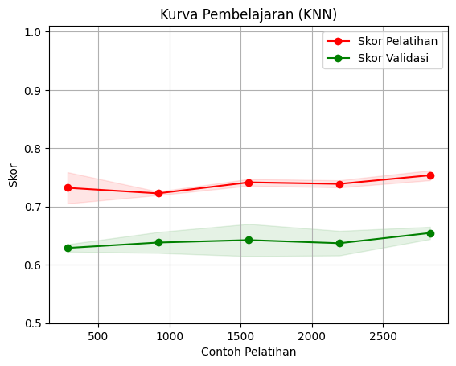

# **Laporan Proyek Machine Learning - Ridwan Setiawan**
## **1. Domain Proyek**
Prediksi dropout dan keberhasilan akademik mahasiswa adalah tantangan utama bagi institusi pendidikan tinggi di seluruh dunia. Dengan memahami faktor-faktor yang memengaruhi status akademik mahasiswa, institusi dapat melakukan intervensi dini untuk mengurangi tingkat putus kuliah dan mendukung keberhasilan akademik. Namun, salah satu hambatan terbesar dalam pengembangan model prediktif adalah ketidakseimbangan data, di mana kelas minoritas seperti mahasiswa dropout sering kali kurang terwakili, menyebabkan model bias terhadap kelas mayoritas seperti graduate atau enrolled.

Untuk mengatasi masalah ini, pendekatan berbasis machine learning diterapkan dengan memanfaatkan data akademik, demografis, dan sosial ekonomi mahasiswa. Teknik seperti Synthetic Minority Over-sampling Technique (SMOTE) digunakan untuk menyeimbangkan data, sementara algoritma seperti Gradient Boosting, Random Forest, dan Support Vector Machine (SVM) dieksplorasi untuk menghasilkan model prediktif yang akurat. Pendekatan ini bertujuan untuk membantu institusi pendidikan tidak hanya dalam memprediksi hasil akademik tetapi juga dalam meningkatkan strategi intervensi yang efektif.

### **Referensi**
- Martins, M.V., Tolledo, D., Machado, J., Baptista, L.M.T., Realinho, V. (2021). *Early Prediction of Student’s Performance in Higher Education: A Case Study*. In: Rocha, Á., Adeli, H., Dzemyda, G., Moreira, F., Ramalho Correia, A.M. (eds) Trends and Applications in Information Systems and Technologies. WorldCIST 2021. Advances in Intelligent Systems and Computing, vol 1365. Springer, Cham. https://doi.org/10.1007/978-3-030-72657-7_16.
- Villar, A., de Andrade, C.R.V. *Supervised Machine Learning Algorithms for Predicting Student Dropout and Academic Success*. Discov Artif Intell 4, 2 (2024). https://doi.org/10.1007/s44163-023-00079-z.
- Mduma, N. *Data Balancing Techniques for Predicting Student Dropout Using Machine Learning*. Data, 8(3), 49 (2023). https://doi.org/10.3390/data8030049.

## **2. Business Understanding**

### **Problem Statement**
Institusi pendidikan tinggi menghadapi tantangan untuk mengurangi tingkat dropout mahasiswa. Mahasiswa dropout tidak hanya kehilangan kesempatan pendidikan, tetapi institusi juga menghadapi kerugian finansial dan reputasi. Pendekatan berbasis machine learning diperlukan untuk memprediksi status akademik mahasiswa dan melakukan intervensi dini secara efektif.

### **Goals**
1. Mengembangkan model machine learning untuk memprediksi status akademik mahasiswa (Dropout, Enrolled, Graduate).
2. Mengidentifikasi model terbaik berdasarkan kinerja evaluasi dan efisiensi.
3. Mengurangi dimensi data untuk meningkatkan efisiensi pemrosesan dan mengurangi risiko overfitting.

### **Solution Statement**
1. **Algoritma yang Digunakan**:
   - Logistic Regression
   - K-Nearest Neighbors (KNN)
   - Support Vector Machine (SVM)
   - Random Forest
   - Gradient Boosting

   Model terbaik dipilih berdasarkan kinerja evaluasi pada data uji.

2. **Hyperparameter Tuning**:
   - Menggunakan **RandomizedSearchCV** untuk mengoptimalkan hyperparameter pada setiap algoritma.

3. **Evaluasi Model**:
   - Model dievaluasi berdasarkan metrik berikut:
     - **Training Score**: Mengukur akurasi model pada data pelatihan.
     - **Test Score**: Mengukur performa model pada data uji.
     - **Waktu Pelatihan**: Menilai efisiensi pelatihan model.
     - **Parameter Terbaik**: Hasil dari RandomizedSearchCV untuk memastikan performa optimal.

4. **Reduksi Dimensi dengan PCA**:
   - **Principal Component Analysis (PCA)** diterapkan untuk mengurangi jumlah fitur, meningkatkan efisiensi pemrosesan, dan meminimalkan risiko overfitting.

Solusi ini bertujuan untuk memilih model terbaik yang tidak hanya akurat tetapi juga efisien dalam prediksi status akademik mahasiswa.
## **3. Data Understanding**

### **Deskripsi Dataset**
Dataset ini mencakup data akademik, demografis, dan sosial ekonomi mahasiswa. Dataset memiliki **4,424 baris** dan **35 kolom**, dengan kolom target `Student Status` yang memiliki tiga kategori: Dropout (0), Enrolled (1), dan Graduate (2). Semua kolom dataset telah diubah menjadi numerik, kecuali untuk target yang di-encode menjadi kategori numerik.

### **Kondisi Data**
1. **Jumlah Baris dan Kolom**: Dataset terdiri dari 4,424 baris dan 35 kolom.
2. **Missing Value**: Tidak ada nilai yang hilang pada dataset.
3. **Duplikat**: Tidak ditemukan data duplikat.
4. **Outlier**: Outlier pada fitur numerik diidentifikasi melalui distribusi data, seperti `Age at Enrollment` dan `Curricular Units`.

### **Distribusi Kelas Target**
Distribusi kelas target `Student Status` menunjukkan bahwa dataset ini tidak seimbang, dengan proporsi terbesar adalah kelas Graduate (lulus). Berikut adalah distribusi setiap kelas:

- **Lulus (Graduate)**: 49.93%
- **Dropout**: 32.12%
- **Terdaftar (Enrolled)**: 17.95%

Visualisasi distribusi kelas dapat dilihat pada diagram berikut:


### **Tautan Sumber Data**
Dataset diunduh dari UCI Machine Learning Repository:  
- **Judul Dataset**: Predict Students' Dropout and Academic Success  
- **Link Dataset**: [Predict Students' Dropout and Academic Success](https://archive.ics.uci.edu/dataset/697/predict+students+dropout+and+academic+success)

### **Informasi Fitur Dataset**
Berikut adalah informasi lengkap mengenai kolom dalam dataset:

| **Kolom**                                | **Tipe Data** | **Jumlah Data** | **Duplikat** | **Missing Value** | **Keterangan (Deskripsi dalam Bahasa Indonesia)**             |
|------------------------------------------|---------------|-----------------|--------------|-------------------|----------------------------------------------------------------|
| `Marital Status`                         | integer       | 4,424           | 0            | 0                 | Status perkawinan mahasiswa                                    |
| `Application Mode`                       | integer       | 4,424           | 0            | 0                 | Metode pendaftaran mahasiswa                                  |
| `Application Order`                      | integer       | 4,424           | 0            | 0                 | Urutan aplikasi mahasiswa                                      |
| `Course`                                 | integer       | 4,424           | 0            | 0                 | Program studi mahasiswa                                        |
| `Daytime/Evening Attendance`             | integer       | 4,424           | 0            | 0                 | Kehadiran mahasiswa (pagi/malam)                              |
| `Previous Qualification`                 | integer       | 4,424           | 0            | 0                 | Kualifikasi pendidikan sebelumnya                             |
| `Nationality`                            | integer       | 4,424           | 0            | 0                 | Kebangsaan mahasiswa                                          |
| `Mother's Qualification`                 | integer       | 4,424           | 0            | 0                 | Kualifikasi pendidikan ibu mahasiswa                          |
| `Father's Qualification`                 | integer       | 4,424           | 0            | 0                 | Kualifikasi pendidikan ayah mahasiswa                         |
| `Mother's Occupation`                    | integer       | 4,424           | 0            | 0                 | Pekerjaan ibu mahasiswa                                       |
| `Father's Occupation`                    | integer       | 4,424           | 0            | 0                 | Pekerjaan ayah mahasiswa                                      |
| `Displaced`                              | integer       | 4,424           | 0            | 0                 | Status merantau mahasiswa                                     |
| `Educational Special Needs`              | integer       | 4,424           | 0            | 0                 | Kebutuhan khusus pendidikan                                   |
| `Debtor`                                 | integer       | 4,424           | 0            | 0                 | Status mahasiswa sebagai penunggak pembayaran                |
| `Tuition Fees Up To Date`                | integer       | 4,424           | 0            | 0                 | Pembayaran uang kuliah tepat waktu                            |
| `Gender`                                 | integer       | 4,424           | 0            | 0                 | Jenis kelamin mahasiswa                                       |
| `Scholarship Holder`                     | integer       | 4,424           | 0            | 0                 | Status mahasiswa sebagai penerima beasiswa                   |
| `Age at Enrollment`                      | integer       | 4,424           | 0            | 0                 | Usia mahasiswa saat mendaftar                                 |
| `International`                          | integer       | 4,424           | 0            | 0                 | Status mahasiswa internasional                                |
| `Curricular Units 1st Sem (Credited)`    | integer       | 4,424           | 0            | 0                 | Jumlah mata kuliah disetujui di semester pertama              |
| `Curricular Units 1st Sem (Enrolled)`    | integer       | 4,424           | 0            | 0                 | Jumlah mata kuliah yang diambil di semester pertama           |
| `Curricular Units 1st Sem (Evaluations)` | integer       | 4,424           | 0            | 0                 | Jumlah evaluasi mata kuliah di semester pertama               |
| `Curricular Units 1st Sem (Approved)`    | integer       | 4,424           | 0            | 0                 | Jumlah mata kuliah lulus di semester pertama                  |
| `Curricular Units 1st Sem (Grade)`       | float         | 4,424           | 0            | 0                 | Nilai rata-rata mata kuliah di semester pertama               |
| `Curricular Units 2nd Sem (Credited)`    | integer       | 4,424           | 0            | 0                 | Jumlah mata kuliah disetujui di semester kedua                |
| `Curricular Units 2nd Sem (Enrolled)`    | integer       | 4,424           | 0            | 0                 | Jumlah mata kuliah yang diambil di semester kedua             |
| `Curricular Units 2nd Sem (Evaluations)` | integer       | 4,424           | 0            | 0                 | Jumlah evaluasi mata kuliah di semester kedua                 |
| `Curricular Units 2nd Sem (Approved)`    | integer       | 4,424           | 0            | 0                 | Jumlah mata kuliah lulus di semester kedua                    |
| `Curricular Units 2nd Sem (Grade)`       | float         | 4,424           | 0            | 0                 | Nilai rata-rata mata kuliah di semester kedua                 |
| `Unemployment Rate`                      | float         | 4,424           | 0            | 0                 | Tingkat pengangguran di daerah mahasiswa                      |
| `Inflation Rate`                         | float         | 4,424           | 0            | 0                 | Tingkat inflasi di daerah mahasiswa                           |
| `GDP`                                    | float         | 4,424           | 0            | 0                 | Produk Domestik Bruto di daerah mahasiswa                     |
| `Student Status`                         | integer       | 4,424           | 0            | 0                 | Status mahasiswa: Dropout (0), Enrolled (1), Graduate (2)     |

#### **Status Tabel**
Dataset ini telah diperiksa untuk **missing value**, **duplikasi**, dan **outlier**. Tidak ditemukan data yang hilang atau duplikat, dan fitur numerik telah dianalisis untuk outlier menggunakan distribusi statistik. Dataset ini siap untuk digunakan dalam proses machine learning dengan sedikit preprocessing tambahan, seperti reduksi dimensi menggunakan PCA.

## **4. Data Preparation**

### **Langkah-Langkah Persiapan Data**

1. **Perubahan Nama Kolom Target**  
   - Nama kolom target diubah dari **`Target`** menjadi **`Student Status`** untuk memberikan deskripsi yang lebih jelas mengenai isi kolom.

2. **Konversi Target dari Teks ke Numerik**  
   - Nilai dalam kolom target `Student Status` diubah dari format teks menjadi numerik:
     - **Dropout**: 0  
     - **Enrolled**: 1  
     - **Graduate**: 2  
   - Konversi ini memastikan algoritma machine learning dapat memproses target secara langsung.

   

3. **Analisis Korelasi dengan Spearman**  
   - Korelasi Spearman digunakan untuk mengukur hubungan antar fitur dalam dataset, khususnya dengan target `Student Status`.
   - Berdasarkan analisis, fitur dengan korelasi rendah terhadap target `Student Status` (< 0.1) dianggap kurang relevan untuk proses pemodelan.
   - Heatmap berikut menunjukkan korelasi antar fitur dalam dataset:

   

   **Korelasi Positif yang Signifikan**  
   Beberapa fitur dalam dataset menunjukkan korelasi positif yang signifikan, terutama variabel terkait kinerja akademik, seperti **`Total_CU_Approved`** dan **`Total_CU_Grade`**, yang berkorelasi positif dengan `Student Status`. Korelasi ini menunjukkan bahwa jumlah mata kuliah yang disetujui dan nilai rata-rata sangat terkait dengan kelulusan mahasiswa. Temuan ini konsisten dengan penelitian sebelumnya yang menunjukkan bahwa performa akademik semester awal sangat berpengaruh pada kelulusan mahasiswa.

   **Korelasi Negatif yang Signifikan**  
   Fitur seperti **`Debtor`** dan **`Age at Enrollment`** menunjukkan korelasi negatif dengan `Student Status`, yang menunjukkan bahwa mahasiswa yang memiliki utang atau yang lebih tua saat mendaftar cenderung memiliki peluang lebih rendah untuk lulus. Hubungan ini sejalan dengan penelitian sebelumnya yang menemukan bahwa faktor-faktor sosial ekonomi dapat memengaruhi kelulusan mahasiswa.

   **Multikolinearitas**  
   Korelasi yang kuat antar beberapa variabel, seperti **`Curricular units 1st sem (approved)`** dan **`Curricular units 2nd sem (approved)`**, menunjukkan potensi masalah multikolinearitas. Multikolinearitas adalah ketika dua atau lebih variabel sangat berkorelasi satu sama lain, yang dapat menurunkan kinerja model prediksi. Untuk mengatasi masalah ini, penghapusan atau penggabungan fitur yang berkorelasi tinggi perlu dipertimbangkan guna mengurangi bias dan meningkatkan performa model.

4. **Reduksi Dimensi dengan PCA (Principal Component Analysis)**  
   - Principal Component Analysis (PCA) digunakan untuk mengurangi jumlah fitur dalam dataset.
   - Jumlah komponen utama dipilih berdasarkan grafik kontribusi varians kumulatif, dengan ambang batas 95%:

   

   - Fitur dengan kontribusi kecil terhadap target kemungkinan dihapus selama proses reduksi dimensi. Contoh fitur yang berpotensi dihapus mencakup:
     - **`Nationality`**, **`International`**, **`GDP`**, **`Unemployment Rate`**, **`Inflation Rate`**.
   - Dataset yang tersisa setelah PCA hanya mencakup fitur yang paling relevan terhadap target `Student Status`.

5. **Feature Engineering**  
   - Beberapa fitur baru dibuat untuk meningkatkan kualitas prediksi:
     - **`Interaction_CU_1st_2nd_Approved`**: Mengalikan jumlah mata kuliah yang disetujui di semester pertama dan kedua.
     - **`Total_CU_Approved`**: Penjumlahan total mata kuliah yang disetujui di kedua semester.
     - **`Total_CU_Grade`**: Rata-rata nilai antara semester pertama dan kedua.
   - Fitur baru ini dievaluasi berdasarkan korelasi dengan target `Student Status` menggunakan heatmap berikut:

   

   **Analisis Gambar**  
   - **Faktor dengan Korelasi Positif Tinggi**:
     - **`Interaction_CU_1st_2nd_Grade`** dan **`Total_CU_Approved`** memiliki korelasi positif tertinggi (0.59) terhadap `Student Status`.
       - Mahasiswa yang berhasil menyelesaikan lebih banyak mata kuliah cenderung memiliki peluang lebih tinggi untuk lulus.
     - **`Total_CU_Grade`** memiliki korelasi positif signifikan (0.55), menunjukkan bahwa performa akademik (nilai rata-rata) berperan besar dalam kelulusan mahasiswa.
     - Temuan ini mendukung literatur bahwa performa akademik pada semester awal sangat memengaruhi keberhasilan akademik.

   - **Faktor dengan Korelasi Negatif Signifikan**:
     - **`Age at Enrollment`** (-0.24) dan **`Debtor`** (-0.24) memiliki korelasi negatif signifikan dengan `Student Status`.
       - Mahasiswa yang lebih tua saat mendaftar memiliki peluang lebih rendah untuk lulus, mungkin karena kesulitan menyesuaikan diri.
       - Status debitur menunjukkan kendala finansial yang dapat memengaruhi keberhasilan akademik.

   - **Multikolinearitas**:
     - Korelasi yang tinggi antara **`Interaction_CU_1st_2nd_Grade`**, **`Total_CU_Approved`**, dan **`Total_CU_Grade`** menunjukkan potensi multikolinearitas.
     - Untuk mengatasi hal ini, perlu dilakukan penghapusan atau penggabungan fitur yang sangat berkorelasi untuk meningkatkan performa model.

6. **Pembagian Data**  
   - Dataset dibagi menjadi **data latih (80%)** dan **data uji (20%)** setelah feature engineering.
   - Pembagian ini dilakukan untuk memastikan evaluasi model yang adil pada data yang tidak terlihat sebelumnya.

## **5. Modeling**

### **Pendekatan Pemodelan**
Untuk memprediksi status akademik mahasiswa (`Student Status`), lima algoritma machine learning diterapkan:
1. **Logistic Regression**
2. **K-Nearest Neighbors (KNN)**
3. **Support Vector Machine (SVM)**
4. **Random Forest**
5. **Gradient Boosting**

### **Teknik yang Digunakan**
1. **Synthetic Minority Over-sampling Technique (SMOTE)**  
   - Karena dataset tidak seimbang, **SMOTE** diterapkan untuk membuat data sintetis bagi kelas minoritas (Dropout dan Enrolled) sehingga distribusi kelas menjadi lebih seimbang.
   - SMOTE diterapkan dalam pipeline untuk mengintegrasikan proses penyeimbangan data dengan pemodelan.

2. **RandomizedSearchCV untuk Hyperparameter Tuning**  
   - Untuk mengoptimalkan kinerja model, **RandomizedSearchCV** digunakan untuk melakukan tuning hyperparameter secara efisien.
   - Proses ini menguji kombinasi parameter terbaik untuk setiap algoritma berdasarkan grid parameter tertentu.

### **Hasil pembelajaran**
#### **- Gradient Boosting**

- **Training Score**: 0.7550
- **Test Score**: 0.7087
- **Waktu Pelatihan**: 4 menit 51 detik
- **Parameter Terbaik**:
  ```python
  {
      'model__validation_fraction': 0.2,
      'model__tol': 0.0001,
      'model__subsample': 1.0,
      'model__n_iter_no_change': 20,
      'model__n_estimators': 150,
      'model__max_depth': 4,
      'model__learning_rate': 0.01
  }

### **Kurva Pembelajaran**
Gambar berikut menunjukkan **kurva pembelajaran untuk Gradient Boosting**, dengan skor pelatihan dan validasi pada berbagai ukuran data pelatihan:


**Analisis Gambar**:
- **Overfitting Awal**:
  - Pada ukuran data pelatihan kecil (< 500 contoh), model menunjukkan overfitting, dengan skor pelatihan jauh lebih tinggi dibanding skor validasi.
- **Konvergensi**:
  - Saat jumlah data pelatihan meningkat, skor validasi dan pelatihan mulai mendekati satu sama lain.
  - Hal ini menunjukkan bahwa model semakin stabil dengan tambahan data, meskipun skor validasi tetap berada di bawah skor pelatihan.
- **Kesimpulan**:
  - Model Gradient Boosting membutuhkan data pelatihan yang cukup untuk mencapai generalisasi yang lebih baik.
  - Namun, meskipun model mengalami overfitting ringan, model tetap memberikan hasil yang baik dengan **Test Score** sebesar **0.7087**.
 
#### **- Random Forest**
- **Training Score**: 0.7296
- **Test Score**: 0.6897
- **Waktu Pelatihan**: 32 detik
- **Parameter Terbaik**:
  ```python
  {
    'model__n_estimators': 125,
    'model__min_samples_split': 6,
    'model__min_samples_leaf': 2,
    'model__max_features': 'log2',
    'model__max_depth': 4
  }


Gambar berikut menunjukkan **kurva pembelajaran untuk Random Forest**, dengan skor pelatihan dan validasi pada berbagai ukuran data pelatihan:


**Analisis Gambar**:
- **Overfitting Awal**:
  - Pada ukuran data pelatihan kecil (< 500 contoh), model menunjukkan overfitting ringan, dengan skor pelatihan jauh lebih tinggi dibanding skor validasi.
- **Konvergensi**:
  - Saat ukuran data pelatihan meningkat, skor pelatihan dan validasi mendekati satu sama lain, menunjukkan bahwa model semakin stabil dengan tambahan data.
  - Skor validasi terlihat lebih stabil dibandingkan Gradient Boosting, mencerminkan bahwa Random Forest lebih tahan terhadap overfitting.
- **Kesimpulan**:
  - Random Forest memberikan hasil yang seimbang dengan performa yang baik pada data pelatihan dan validasi.
  - Namun, skor validasi masih sedikit lebih rendah dibandingkan skor pelatihan, menunjukkan ruang untuk perbaikan lebih lanjut dalam optimasi model.


#### **- Logistic Regression**
- **Training Score**: 0.7352
- **Test Score**: 0.7352
- **Waktu Pelatihan**: 4 detik
- **Parameter Terbaik**:
  ```python
  {
    'model__solver': 'liblinear',
    'model__penalty': 'l2',
    'model__C': 0.05
  }


#### **Kurva Pembelajaran**

Gambar berikut menunjukkan **kurva pembelajaran untuk Logistic Regression**, dengan skor pelatihan dan validasi pada berbagai ukuran data pelatihan:


**Analisis Gambar**:
- **Konsistensi Skor**:
  - Model menunjukkan konsistensi yang tinggi antara skor pelatihan dan validasi, dengan kedua skor hampir identik sepanjang peningkatan ukuran data.
- **Generalizability**:
  - Logistic Regression memperlihatkan generalisasi yang sangat baik tanpa adanya overfitting atau underfitting, seperti yang terlihat dari tidak adanya celah signifikan antara skor pelatihan dan validasi.
- **Kesimpulan**:
  - Logistic Regression adalah model yang stabil dan efektif untuk dataset ini, dengan performa prediksi yang cukup andal dan efisien.

#### **- Support Vector Machine (SVM)**
- **Training Score**: 0.7265
- **Test Score**: 0.7231
- **Waktu Pelatihan**: 2 menit 46 detik
- **Parameter Terbaik**:
  ```python
  {
    'model__C': 0.8668695797323276,
    'model__kernel': 'linear'
  }


#### **Kurva Pembelajaran**

Gambar berikut menunjukkan **kurva pembelajaran untuk Support Vector Machine (SVM)**, dengan skor pelatihan dan validasi pada berbagai ukuran data pelatihan:


**Analisis Gambar**:
- **Konsistensi Skor**:
  - Kurva menunjukkan bahwa skor pelatihan dan validasi konsisten satu sama lain, terutama saat jumlah data pelatihan meningkat.
  - Tidak ada celah signifikan antara skor pelatihan dan validasi, yang mengindikasikan bahwa SVM mampu mempelajari pola tanpa overfitting atau underfitting.
- **Generalizability**:
  - Pada dataset ini, SVM menunjukkan kemampuan generalisasi yang baik, dengan skor validasi yang stabil bahkan dengan tambahan data pelatihan.
- **Kesimpulan**:
  - SVM adalah model yang efektif untuk dataset ini, dengan performa yang seimbang dan stabil meskipun waktu pelatihannya relatif lebih lama dibandingkan model lainnya.

#### **- KNN**
- **Training Score**: 0.7564
- **Test Score**: 0.6539
- **Waktu Pelatihan**: 5 detik
- **Parameter Terbaik**:
  ```python
  {
    'model__n_neighbors': 9,
    'model__weights': 'uniform'
  }


#### **Kurva Pembelajaran**

Gambar berikut menunjukkan **kurva pembelajaran untuk K-Nearest Neighbors (KNN)**, dengan skor pelatihan dan validasi pada berbagai ukuran data pelatihan:



**Analisis Gambar**:
- **Overfitting**:
  - Kurva menunjukkan celah signifikan antara skor pelatihan yang tinggi dan skor validasi yang lebih rendah, terutama pada ukuran data pelatihan yang kecil.
  - Hal ini mengindikasikan bahwa KNN mengalami **overfitting**, di mana model terlalu fokus pada data pelatihan.
- **Generalizability**:
  - Skor validasi meningkat secara perlahan dengan bertambahnya jumlah data pelatihan, tetapi masih tertinggal jauh dari skor pelatihan.
- **Kesimpulan**:
  - Meskipun KNN mampu menangkap pola lokal, model ini cenderung sensitif terhadap outlier dan noise dalam dataset, yang mengurangi generalisasi pada data uji.

### **Evaluasi Kinerja**
Berdasarkan evaluasi yang dilakukan terhadap lima model machine learning yang diuji, yaitu Logistic Regression, K-Nearest Neighbors (KNN), Support Vector Machine (SVM), Random Forest, dan Gradient Boosting, model **Gradient Boosting** dinilai sebagai model terbaik untuk kasus prediksi status akademik mahasiswa ini. Berikut adalah alasan pemilihannya:

**1. Kinerja Evaluasi**
- **Test Score** tertinggi: Gradient Boosting mencapai skor uji sebesar **0.7087**, yang lebih tinggi dibandingkan model lainnya. Hal ini menunjukkan kemampuan model dalam memprediksi status akademik mahasiswa dengan akurasi yang baik pada data yang tidak terlihat.
- Gradient Boosting menunjukkan peningkatan skor secara konsisten pada data pelatihan yang lebih besar, menunjukkan bahwa model ini mampu menangkap pola data yang kompleks.

**2. Generalisasi yang Baik**
- Meskipun menunjukkan sedikit **overfitting awal**, Gradient Boosting berhasil mencapai **konvergensi skor validasi dan pelatihan** yang lebih baik dibandingkan KNN, yang memiliki celah besar antara skor pelatihan dan validasi.
- Model ini mampu mengatasi ketidakseimbangan data dengan lebih efektif berkat integrasi SMOTE dalam pipeline, sehingga memberikan hasil yang lebih representatif untuk semua kelas target.

**3. Fleksibilitas dan Ketahanan**
- Gradient Boosting memiliki fleksibilitas tinggi dalam menangani berbagai jenis data dan interaksi antar fitur. Dengan tuning hyperparameter, model ini menunjukkan performa yang stabil bahkan pada dataset yang memiliki korelasi tinggi antar fitur.

**4. Efisiensi Relatif**
- Waktu pelatihan Gradient Boosting yang berada di kisaran **4 menit 51 detik** relatif sebanding dengan kompleksitas dan performa yang dihasilkan. Sementara itu, model seperti SVM memerlukan waktu pelatihan lebih lama tanpa memberikan peningkatan signifikan pada skor uji.

## **6. Evaluation**

### **Metrik Evaluasi yang Digunakan**
Dalam proyek ini, evaluasi model dilakukan menggunakan metrik berikut:
1. **Training Score**: Mengukur akurasi model pada data pelatihan untuk menilai sejauh mana model dapat mempelajari pola dari data.
2. **Test Score**: Mengukur performa model pada data uji untuk mengevaluasi kemampuan generalisasi model pada data yang tidak terlihat.
3. **Waktu Pelatihan**: Waktu yang dibutuhkan untuk melatih model, yang mencerminkan efisiensi pemrosesan.
4. **Parameter Terbaik**: Parameter hyperparameter yang menghasilkan performa optimal dari hasil tuning.

### **Hasil Evaluasi Model**
Berikut adalah hasil evaluasi dari lima model yang diuji:
| **Model**             | **Training Score** | **Test Score** | **Waktu Pelatihan** | **Parameter Terbaik**                                                                 |
|------------------------|--------------------|----------------|----------------------|---------------------------------------------------------------------------------------|
| Gradient Boosting      | 0.7550            | 0.7087         | 4 menit 51 detik     | `{'validation_fraction': 0.2, 'tol': 0.0001, 'subsample': 1.0, 'n_iter_no_change': 20,` <br> `'n_estimators': 150, 'max_depth': 4, 'learning_rate': 0.01}` |
| Random Forest          | 0.7296            | 0.6897         | 32 detik             | `{'n_estimators': 125, 'min_samples_split': 6, 'min_samples_leaf': 2,` <br> `'max_features': 'log2', 'max_depth': 4}`                                    |
| Logistic Regression    | 0.7352            | 0.7352         | 4 detik              | `{'solver': 'liblinear', 'penalty': 'l2', 'C': 0.05}`                                                                   |
| Support Vector Machine | 0.7265            | 0.7231         | 2 menit 46 detik     | `{'C': 0.8668695797323276, 'kernel': 'linear'}`                                                                          |
| K-Nearest Neighbors    | 0.7564            | 0.6539         | 5 detik              | `{'n_neighbors': 9, 'weights': 'uniform'}`                                                                               |

### **Kesimpulan Hasil Evaluasi**
- **Model Gradient Boosting** menunjukkan performa terbaik dengan **Test Score** tertinggi (0.7087) dan keseimbangan yang baik antara akurasi pelatihan dan uji.
- **Logistic Regression** memiliki waktu pelatihan tercepat, dengan **Test Score** yang cukup baik (0.7352), tetapi model ini kurang fleksibel dalam menangani hubungan non-linear.
- **Support Vector Machine (SVM)** memberikan hasil yang stabil tetapi memerlukan waktu pelatihan yang lebih lama dibandingkan model lainnya.
- **Random Forest** dan **KNN** menunjukkan performa yang lebih rendah dalam generalisasi pada data uji, meskipun cukup baik pada data pelatihan.
